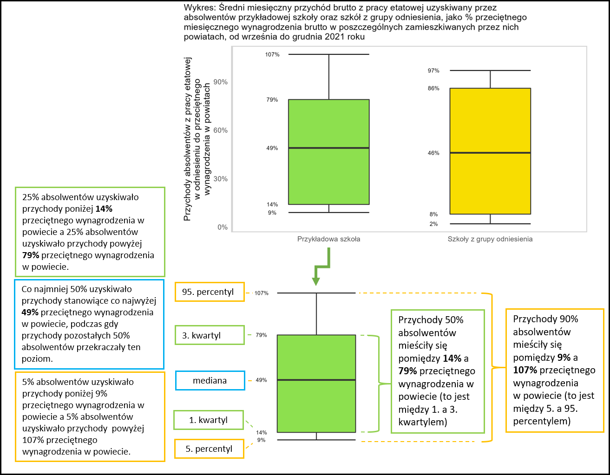

```{r, echo=FALSE, message=FALSE, warning=FALSE}
# biblioteki
library(dplyr)
library(ggplot2)
library(kableExtra)
library(tidyr)
library(forcats)
library(MLASZraportyAdm3)
# if (!exists("params")) {
#   params = list(plikZObiektami = "../../data/wskaznikiAdmin2.RData",
#                 obiektWskazniki = "szk",
#                 obiektWskaznikiPorownanie = "god",
#                 obiektWskaznikiKraj = "kraj",
#                 obiektWskaznikiKraj2 = "kraj2",
#                 progLiczebnosci = 10,
#                 typDokumentu = "pdf",
#                 wyrownanieTabWykr = "center",
#                 rok = 2020)
# }

# obiekty z parametrów
progLiczebnosci = params$progLiczebnosci
typDokumentu = params$typDokumentu
wyrownanieTabWykr = params$wyrownanieTabWykr
rocznik = paste0(params$rok - 1, "/", params$rok)

# zbiory danych
if (params$plikZObiektami != "") {# to działa przy ręcznym prototypowaniu
  load(params$plikZObiektami)
  szk = get(params$obiektWskazniki)
  god = get(params$obiektWskaznikiPorownanie)
} else {# to działa przy wywoływaniu przez generuj_raport()
  szk = get(params$obiektWskazniki)
  god = get(params$obiektWskaznikiPorownanie)
}
god = god %>%
  filter(id_szk %in% szk$id_szk)

# obiekt powiaty
powiaty_dop = powiaty %>%
  filter(teryt_pow %in% szk$teryt_pow[[1]]) %>%
  select(starts_with(szk$odniesieniePoziom[[1]])) %>%
  as.character()
```

```{r testing, eval=params$testowanie, echo=FALSE, message=FALSE, warning=FALSE, results='asis'}
cat(ifelse(typDokumentu %in% "pdf", "---", ""))

cat(
  "ID RSPO szkoły: ",
  szk$id_szk[[1]],
  "\nGrupa odniesienia: ",
  szk$odniesieniePoziom[[1]],
  "\nZmienna rocznik: ",
  rocznik,
  "\nLiczba absolwentów: ",
  szk$l_abs[[1]],
  sep = "")

cat(ifelse(typDokumentu %in% "pdf", "---", ""))
```

`r ifelse(typDokumentu %in% "pdf", "---", "")`

`r ifelse(typDokumentu %in% "pdf", "\\vfill\n\\includegraphics{Belka-Losy-absolwentow-Kolor-PL}", "")`

`r ifelse(typDokumentu %in% "pdf", "\\newpage", "")`

# 1. Wprowadzenie

## Idea monitoringu

Monitoring karier absolwentów to zadanie powierzone ministrowi właściwemu do spraw oświaty w ustawie [Prawo oświatowe](http://isap.sejm.gov.pl/isap.nsf/download.xsp/WDU20210000619/O/D20210619.pdf). Analogiczne rozwiązania funkcjonują od kilku lat w szkolnictwie wyższym. Celem monitoringu jest zapewnianie informacji na temat przebiegu karier absolwentów na potrzeby prowadzenia polityki oświatowej państwa na poziomie krajowym, regionalnym i lokalnym. Wiarygodne i dostarczane cyklicznie statystyki opisujące przebieg karier edukacyjno-zawodowych absolwentów szkół ponadpodstawowych w Polsce mają pomóc w dostosowywaniu kierunków i treści kształcenia do wymogów rynku pracy. Raporty, takie jak ten, są opracowywane dla poszczególnych szkół, żeby pomóc im w monitorowaniu losów kolejnych roczników absolwentów i uzyskiwaniu w ten sposób informacji pomocnych w kształtowaniu oferty oraz podnoszeniu jakości kształcenia. Informacje zawarte w raportach mogą być użyteczne również dla instytucji rynku pracy i pracodawców, a także pomóc uczniom w wyborze kierunku kształcenia.

Należy pamiętać, że oprócz kształcenia w szkole, na sytuację edukacyjną i zawodową absolwentów wpływa wiele innych uwarunkowań. Do takich uwarunkowań należą wiedza i umiejętności zdobyte przed rozpoczęciem nauki w szkole oraz sytuacja na lokalnym rynku pracy i dostępna dla absolwentów oferta edukacyjna. Ponadto dane, na podstawie których są sporządzane raporty, nie odzwierciedlają w pełni aktywności zawodowej absolwentów, nie uwzględniają na przykład pracy podejmowanej za granicą. Dlatego informacji o losach absolwentów nie można, bez uwzględnienia dodatkowego kontekstu, traktować jako miary efektywności poszczególnych szkół.

## Źródła i przetwarzanie danych

Raporty są przygotowywane na podstawie danych z publicznych rejestrów. Monitoring opiera się na danych dotyczących nauki w szkołach ponadpodstawowych (dane Informatycznego Centrum Edukacji i Nauki) oraz na studiach (dane Ośrodka Przetwarzania Informacji nadzorowanego przez ministra właściwego ds. szkolnictwa wyższego i nauki), uzyskiwania dyplomów i świadectw (dane Okręgowych Komisji Egzaminacyjnych) oraz aktywności na rynku pracy (dane Zakładu Ubezpieczeń Społecznych).

Dzięki wykorzystaniu danych rejestrowych monitoring obejmuje niemal całą populację absolwentów.

Pozyskane dane są przetwarzane, łączone i anonimizowane przez Informatyczne Centrum Edukacji i Nauki.

Analizy i sporządzane automatycznie raporty są projektowane i przygotowywane przez Instytut Badań Edukacyjnych. 

## Absolwenci Państwa szkoły uwzględnieni w raporcie

```{r, echo=FALSE, message=FALSE, results='asis', fig.align=wyrownanieTabWykr, warning=FALSE}
cat(
  ifelse(szk$l_abs[[1]] >= progLiczebnosci,
         paste0("Ten raport dotyczy "),
         paste0("Monitoring objął ")),
  szk$l_abs[[1]],
  szk$odmiany[[1]]$abs,
  " (w tym ",
  szk$l_kobiet[[1]],
  " ",
  szk$odmiany[[1]]$kob,
  "), ",
  ifelse(szk$l_abs[[1]] %in% 1,
         paste0("który ukończył"),
         paste0("którzy ukończyli")),
  " Państwa szkołę w roku szkolnym ",
  rocznik,
  ". Informacje o absolwentach pozyskano z Systemu Informacji Oświatowej według stanu bazy na 15 marca 2023 roku. Absolwentami są uczniowie ostatnich klas Państwa szkoły, którym w SIO zakończono przypisanie do oddziału wybierając status \"Ukończył szkołę\". Ze względu na zapewnienie kompletności danych w kolejnych raportach, ważne jest nadawanie przez szkoły takiego statusu absolwentom do końca roku kalendarzowego, w którym zakończyli naukę.\n\nLiczebność grup, dla których prezentowane są wyniki, zależy od dostępności informacji o Państwa absolwentach w poszczególnych rejestrach.\n\n* Ośrodek Przetwarzania Informacji przekazał dane dotyczące ",
  szk$l_abs_zrodla[[1]]$n_opi,
  szk$odmiany[[1]]$abs_opi,
  " Państwa szkoły, którzy rozpoczęli naukę w szkołach wyższych do końca grudnia ", 
  params$rok,
  " roku (według stanu na 31 grudnia 2021 roku).\n\n* Dane z Zakładu Ubezpieczeń Społecznych informują o rejestrowanej przez ZUS aktywności zawodowej ",
  szk$l_abs_zrodla[[1]]$n_zus,
  szk$odmiany[[1]]$abs_zus,
  " Państwa szkoły.\n\n",
  sep = ""
)
```

## Sposób prezentowania wyników

`r ifelse(szk$l_abs[[1]] >= progLiczebnosci, paste0("W raporcie przedstawiono w jakiej sytuacji absolwenci, którzy ukończyli szkołę w roku szkolnym ", rocznik, ", byli w roku ", params$rok, " (kalendarzowym). W dalszej części raportu nazywamy ich \"absolwentami z rocznika ", rocznik, "\". "), "")`Przypisanie absolwentowi określonego statusu (np. “uczy się” lub “pracuje”) w danym miesiącu oznacza, że przynajmniej przez jeden dzień w tym miesiącu miał taki status. 

Wyniki monitoringu prezentujemy w różnych ujęciach:

* Wartości danego wskaźnika w kolejnych miesiącach rozpatrywanego okresu pozwalają śledzić jak zmieniała się sytuacja edukacyjna i zawodowa absolwentów. W przypadku wskaźników odnoszących się do sytuacji edukacyjnej i zawodowej jest to okres od stycznia do grudnia `r params$rok` roku.

* Szczegółowe zestawienia dotyczące sytuacji edukacyjnej i zawodowej absolwentów odnoszą się do ich sytuacji w grudniu `r params$rok` roku, co pozwala na uwzględnienie m.in. kontynuowania przez część absolwentów nauki na studiach.

* Niektóre wskaźniki są zdefiniowane jako średnia wartość w danym okresie (przychód uzyskiwany z pracy) lub okres, w którym absolwent miał określony status (praca, bezrobocie). Takie wskaźniki obliczyliśmy dla okresu od września do grudnia `r params$rok` roku. Wrzesień jest pierwszym miesiącem, w którym absolwenci formalnie nie byli już uczniami Państwa szkoły, a grudzień ostatnim, dla którego w momencie sporządzania tego raportu dysponujemy kompletnymi danymi o absolwentach figurujących w rejestrach.

Niektóre wyniki dotyczące absolwentów Państwa szkoły zostały zestawione z wynikami dotyczącymi grupy odniesienia. Grupę odniesienia stanowią absolwenci, którzy ukończyli inne branżowe szkoły II stopnia – niezależnie od tego czy były to szkoły publiczne czy niepubliczne i jaki podmiot był ich organem prowadzącym. W rozdziale "Ścieżki edukacyjno-zawodowe" grupa odniesienia jest dynamiczna: dobierana z najmniejszego obszaru – powiatu, podregionu^[Informacje nt. administracyjnego podziału Polski na podregiony (jednostki NUTS 3) są dostępne na stronie: https://stat.gov.pl/statystyka-regionalna/jednostki-terytorialne/klasyfikacja-nuts/klasyfikacja-nuts-w-polsce/], województwa lub kraju – w którym jest łącznie co najmniej 10 absolwentów co najmniej 3 branżowych szkół II stopnia innych^[Absolwenci Państwa szkoły są wykluczani z grupy odniesienia, ponieważ w niektórych przypadkach ich sytuacja mogłaby w dużym stopniu rzutować na wyniki dotyczące tej grupy.] niż Państwa szkoła. Zasada ta chroni anonimowość absolwentów, a także uniemożliwia przypisanie wyników dotyczących grupy odniesienia do konkretnej szkoły. Absolwenci Państwa szkoły mogą być zestawiani z różnymi grupami odniesienia, w zależności od tego, czy prezentowane są wyniki dla ogółu absolwentów, czy w podziale ze względu na wyuczony zawód^[Na przykład dla ogółu absolwentów szkoły, której dotyczy raport, grupę odniesienia mogą stanowić absolwenci pozostałych branżowych szkół II stopnia z danego powiatu, ale dla absolwentów wykształconych w danym zawodzie grupa odniesienia z poziomu powiatu mogłaby nie spełniać wymogów dotyczących liczebności. W takiej sytuacji zostałaby dobrana z poziomu podregionu, województwa lub kraju - w zależności od tego na ile powszechne jest kształcenie w danym zawodzie.].

**Ze względu na potrzebę zachowania anonimowości absolwentów, dane dla grup liczących poniżej 10 osób nie są prezentowane również w przypadku absolwentów Państwa szkoły.** W celu zachowania czytelności, na wykresach nie są umieszczane wartości etykiet poniżej 6%.

`r ifelse(typDokumentu %in% "pdf", "\\newpage", "")`

## Prośba o wypełnienie krótkiej ankiety zwrotnej dla IBE

System monitoringu karier oparty na danych administracyjnych będzie rozwijany w kolejnych latach. W dalszym dostosowywaniu go do potrzeb szkół bardzo przydatne będą Państwa opinie. Dlatego będziemy wdzięczni za wypełnienie kolejnej ankiety on-line przygotowanej przez Instytut Badań Edukacyjnych, który jest odpowiedzialny za opracowanie wyników monitoringu. 

Ankieta dotyczy Państwa opinii i uwag odnośnie raportu (dlatego przed wypełnieniem ankiety prosimy się z nim zapoznać), potrzeb dotyczących monitorowania losów absolwentów oraz wykorzystania wyników.

Wyniki wypełnionej przez Państwa ankiety nie będą prezentowane w powiązaniu z konkretnymi szkołami.

**Ankieta otworzy się w przeglądarce internetowej po kliknięciu w link:**

`r szk$link`

```{r, echo=FALSE, message=FALSE, warning=FALSE, out.width = '100%'}
knitr::include_graphics(szk$qr_code)
```

W każdym raporcie szkolnym umieszczono inny link do ankiety. Po wypełnieniu, ankieta nie będzie już dla Państwa dostępna. W przypadku prośby o podanie kodu dostępu prosimy wpisać następujący ciąg znaków: `r szk$token`

Wypełnienie ankiety zajmie około 10 minut.

Ankieta będzie dostępna do grudnia 2023 roku, przy czym w kolejnej edycji monitoringu będziemy w stanie uwzględnić wyniki ankiet wypełnionych do czerwca 2023 roku, dlatego będziemy szczególnie wdzięczni za wypełnienie ankiety do końca tego miesiąca.

## Wykorzystanie raportu

Przy wykorzystywaniu informacji z raportów prosimy o podanie źródła:

*Raport roczny z monitoringu karier absolwentów, których szkołą ukończoną w `r params$rok` roku było `r szk$dane_szkoly[[1]]$nazwa`. Monitoring na podstawie danych rejestrowych. Warszawa: Instytut Badań Edukacyjnych, 2023.*

Raport jest dostępny na zasadach licencji ["Creative Commons Uznanie autorstwa-Użycie niekomercyjne-Na tych samych warunkach 4.0 Międzynarodowe"](https://creativecommons.org/licenses/by-nc-sa/4.0/deed.pl).

`r ifelse(typDokumentu %in% "pdf", "\\newpage", "")`

# 2. Ścieżki edukacyjno-zawodowe

W tym rozdziale prezentowane są 4 statusy absolwentów opisujące ich sytuację edukacyjno-zawodową w różnych momentach. Poniższa tabela przybliża konstrukcję poszczególnych statusów.

```{r, echo=FALSE, message=FALSE, results='asis', fig.align=wyrownanieTabWykr, warning=FALSE}
data.frame(
  `Kategoria` = "Znaczenie kategorii",
  `1. Tylko nauka` = "W takiej sytuacji są osoby, o których wiadomo, że odbywają edukację formalną w Polsce i jednocześnie figurują w rejestrze ZUS z tytułu innego niż aktualne wykonywanie pracy (\"innym tytułem\" może być w szczególności status osoby bezrobotnej, przebywanie na urlopie macierzyńskim lub wychowawczym) lub nie figurują w rejestrze ZUS z żadnego tytułu, w związku z tym ich sytuacja zawodowa nie jest znana. Nie jest wykluczone, że pracują za granicą u zagranicznego pracodawcy lub korzystając z ubezpieczenia w innym systemie niż ZUS (np. KRUS) albo na podstawie umowy o dzieło lub (jeżeli mają nie więcej niż 26 lat) umowy zlecenia albo bez umowy (\"na czarno\").",
  `2. Nauka i praca` = "W takiej sytuacji są osoby, o których wiadomo, że odbywają edukację formalną w Polsce, a zarazem figurują w rejestrze ZUS z tytułu aktualnego wykonywania pracy etatowej, prowadzenia indywidualnej działalności gospodarczej albo - ale tylko, jeśli mają więcej niż 26 lat - umowy zlecenia. Nie jest natomiast uwzględniana praca za granicą u zagranicznego pracodawcy, praca związana z korzystaniem z ubezpieczenia w innym systemie niż ZUS (np. KRUS), praca na podstawie umowy o dzieło - a w przypadku osób, które mają nie więcej niż 26 lat również praca na podstawie umowy zlecenia - oraz praca bez umowy (\"na czarno\").",
  `3. Tylko praca` = "W takiej sytuacji są osoby, o których wiadomo, że nie odbywają edukacji formalnej w Polsce (ale być może uczą się w innym kraju), a zarazem figurują w rejestrze ZUS z tytułu aktualnego wykonywania pracy etatowej, umowy zlecenia lub prowadzenia indywidualnej działalności gospodarczej. Nie jest natomiast uwzględniana praca za granicą u zagranicznego pracodawcy, praca bez umowy (\"na czarno\"), praca związana z korzystaniem z ubezpieczenia w innym systemie niż ZUS (np. KRUS) ani praca na podstawie umowy o dzieło.",
  `4. Brak nauki i brak pracy` = "W takiej sytuacji są osoby, o których wiadomo, że nie odbywają edukacji formalnej w Polsce (ale być może uczą się w innym kraju), a zarazem figurują w rejestrze ZUS z tytułu bezrobocia lub innego powodu niż aktualne wykonywanie pracy etatowej, umowy zlecenia lub prowadzenie indywidualnej działalności gospodarczej lub nie figurują w rejestrze ZUS z żadnego tytułu, w związku z tym ich sytuacja zawodowa nie jest znana.\nNie jest wykluczone, że pracują za granicą u zagranicznego pracodawcy lub korzystając z ubezpieczenia w innym systemie niż ZUS (np. KRUS) albo na podstawie umowy o dzieło (jeżeli nie są zarejestrowane jako bezrobotne), albo bez umowy (\"na czarno\").",
  check.names = FALSE) %>% 
  pivot_longer(everything()) %>% 
  rename(`Kategoria` = name,
         `Znaczenie kategorii` = value) %>% 
  filter(!row_number() %in% 1) %>% 
  kable(format = "latex",
        booktabs = TRUE,
        escape = FALSE,
        longtable = TRUE,
        align = "ll",
        linesep = "\\addlinespace") %>% 
  kable_styling(position = wyrownanieTabWykr,
                latex_options = c("hold_position", "repeat_header"),
                repeat_header_text = "(ciąg dalszy tabeli)") %>% 
  column_spec(1, width = "4cm") %>%
  column_spec(2, width = "12cm")
```

```{r, echo=FALSE, message=FALSE, results='asis', fig.align=wyrownanieTabWykr, warning=FALSE}
if (szk$S3_12[[1]]$n >= progLiczebnosci) {
  cat(
    "Spośród absolwentów Państwa szkoły z rocznika ",
    rocznik,
    " w grudniu ",
    params$rok,
    " roku kształciło się ",
    round((szk$S3_12[[1]]$ucz_prac + szk$S3_12[[1]]$tylko_ucz) * 100),
    "%, podczas gdy spośród absolwentów pozostałych branżowych szkół II stopnia z ",
    powiaty_dop,
    " ",
    round((god$S3_12[[1]]$ucz_prac + god$S3_12[[1]]$tylko_ucz) * 100),
    "%.\n\nStudia lub edukację w szkole policealnej z zatrudnieniem na podstawie umowy o pracę lub z wykonywaniem własnej działalności gospodarczej (samozatrudnieniem)^[W przypadku uczniów i studentów do 26. roku życia nie są dostępne dane dotyczące ewentualnego wykonywania pracy na podstawie umów cywilnoprawnych.] łączyło ",
    round(szk$S3_12[[1]]$ucz_prac * 100),
    "% absolwentów Państwa szkoły. Odsetek takich osób wśród absolwentów Państwa szkoły był ",
    case_when(
      round(szk$S3_12[[1]]$ucz_prac * 100) < round(god$S3_12[[1]]$ucz_prac * 100) ~ "niższy niż",
      round(szk$S3_12[[1]]$ucz_prac * 100) > round(god$S3_12[[1]]$ucz_prac * 100) ~ "wyższy niż",
      round(szk$S3_12[[1]]$ucz_prac * 100) %in% round(god$S3_12[[1]]$ucz_prac * 100) ~ "taki sam, jak"
    ),
    " wśród absolwentów pozostałych branżowych szkół II stopnia z ", 
    powiaty_dop,
    " (",
    round(god$S3_12[[1]]$ucz_prac * 100),
    "%), z tego samego rocznika.\n\nW tym samym miesiącu ",
    round(szk$S3_12[[1]]$tylko_prac * 100),
    "% absolwentów Państwa branżowej szkoły II stopnia pracowało^[Na podstawie umowy o pracę, umowy cywilnoprawnej lub prowadząc własną działalność gospodarczą.], ale nie studiowało ani nie uczęszczało do kolejnej szkoły. Do grupy pracujących, ale nie kontynuujących edukacji formalnej należało ",
    round(god$S3_12[[1]]$tylko_prac * 100),
    "% absolwentów z ",
    powiaty_dop,
    ".\n\nSpośród absolwentów Państwa szkoły w grudniu ",
    params$rok,
    " roku ",
    round(szk$S3_12[[1]]$neet * 100),
    "% nie kontynuowało nauki w szkole policealnej, nie studiowało ani nie wykonywało pracy odnotowywanej przez ZUS^[Na podstawie umowy o pracę, na podstawie umowy cywilnoprawnej ani prowadząc własną działalność gospodarczą.]. W takiej samej sytuacji było ",
    round(god$S3_12[[1]]$neet * 100),
    "% absolwentów pozostałych branżowych szkół II stopnia z ",
    powiaty_dop,
    ".\n",
    sep = ""
  )
} else {
  cat("Liczba absolwentów Państwa szkoły nie była wystarczająca, żeby możliwe było przedstawienie wyników zgodnie z zasadą chroniącą anonimowość absolwentów.")
}
```

```{r, echo=FALSE, message=FALSE, results='asis', fig.align=wyrownanieTabWykr, warning=FALSE}
if (szk$S3_12[[1]]$n >= progLiczebnosci) {
  nazwy_wierszy = c(
    "Nauka i praca",
    "Tylko nauka",
    "Tylko praca",
    "Brak nauki i brak pracy")
  
  tab = tab_wykres(szk$S3_12[[1]],
                   god$S3_12[[1]],
                   NULL,
                   powiaty_dop,
                   nazwy_wierszy,
                   szk$typ_szk[[1]],
                   80) %>% 
    mutate(name = ordered(name, levels = c("Brak nauki i brak pracy",
                                           "Tylko praca",
                                           "Nauka i praca",
                                           "Tylko nauka")))
  
  wykres = wykres_poziomy_statusy(
    tab,
    wrapper(paste0("Wykres ",
                   wyk_num(),
                   ": Status edukacyjno-zawodowy absolwentów Państwa szkoły oraz absolwentów pozostałych branżowych szkół II stopnia z ",
                   powiaty_dop,
                   ", w grudniu ",
                   params$rok,
                   " roku - ogółem"), 80))
  
  levels(tab$typ) = linebreak(levels(tab$typ), align = "l")
  
  tabela = tab %>% 
    mutate(across(name,
                  ~ordered(name,
                           levels = c("Brak nauki i brak pracy",
                                      "Tylko praca",
                                      "Nauka i praca",
                                      "Tylko nauka"),
                           labels = c("neet", "tylko_prac", "ucz_prac", "tylko_ucz")))) %>% 
    select(-lab) %>% 
    pivot_wider(names_from = name) %>% 
    select(typ, tylko_ucz, ucz_prac, tylko_prac, neet) %>% 
    mutate(across(tylko_ucz:neet,
                  ~ round(. * 100))) %>%
    mutate(across(tylko_ucz:neet,
                  ~ paste0(., "\\%"))) %>%
    kable(format = "latex", booktabs = TRUE, escape = FALSE, longtable = TRUE,
          linesep = "",
          align = "lcccc",
          col.names = NULL,
          digits = 0) %>% 
    kable_styling(position = wyrownanieTabWykr,
                  latex_options = c("hold_position", "repeat_header"),
                  font_size = 10,
                  full_width = TRUE,
                  repeat_header_text = "(ciąg dalszy tabeli)") %>% 
    add_header_above(c("", "1" = 1, "2" = 1, "3" = 1, "4" = 1),
                     align = c("l", "c", "c", "c", "c")) %>%
    add_header_above(c(" ",
                       "1. Tylko nauka\n2. Nauka i praca\n3. Tylko praca\n4. Brak nauki i brak pracy" = 4),
                     align = c("c", "l")) %>% 
    column_spec(1, width = "6cm") %>%
    column_spec(2, width = "2.25cm") %>%
    column_spec(3, width = "2.25cm") %>%
    column_spec(4, width = "2.25cm") %>%
    column_spec(5, width = "2.25cm")
  
  zwroc_wykres_tabela(wykres, tabela)
}
```

```{r, echo=FALSE, message=FALSE, error=FALSE, warning=FALSE, results='asis', fig.align=wyrownanieTabWykr}
if (szk$S3_12[[1]]$n >= progLiczebnosci) {
  tab_s3_zaw_check = szk$tab_s3_zaw[[1]] %>% 
    as_tibble()
  if (nrow(tab_s3_zaw_check) > 0) {
    tab_s3_zaw_check = tab_s3_zaw_check %>%  
      filter(!row_number() %in% nrow(.)) %>%
      filter(n >= 10) %>% 
      arrange(n, nazwa_zaw) %>%
      mutate(typ = ordered(.$nazwa_zaw, levels = unique(.$nazwa_zaw))) %>% 
      select(-c(n, nazwa_zaw))
  } else {
    tab_s3_zaw_check = tibble()
  }
  
  if (nrow(tab_s3_zaw_check) %in% 0) {
    cat("W przypadku żadnego zawodu liczba absolwentów Państwa szkoły nie była wystarczająca, żeby możliwe było przedstawienie wyników w tym ujęciu zgodnie z zasadą chroniącą anonimowość absolwentów.")
  } else if (nrow(tab_s3_zaw_check) %in% 1) {
    cat("Poniższy wykres przedstawia sytuację absolwentów wykształconych w Państwa szkole w zawodzie, w którym kształciło się co najmniej 10 osób.")
  } else if (nrow(tab_s3_zaw_check) > 1) {
    cat("Poniższe tabele i wykresy przedstawiają sytuację absolwentów Państwa szkoły wykształconych w poszczególnych zawodach, o ile kształciło się w nich co najmniej 10 osób.")
  }
}
```

```{r petla_zawody_S3, echo=FALSE, message=FALSE, warning=FALSE, results='asis', fig.align=wyrownanieTabWykr}
if (szk$S3_12[[1]]$n >= progLiczebnosci) {
  if (nrow(tab_s3_zaw_check) > 0) {
    szkozaw = szkozaw %>% 
      filter(id_szk %in% szk$id_szk)
    
    for (i in tab_s3_zaw_check$typ) {
      tab_szk = tab_s3_zaw_check[tab_s3_zaw_check$typ %in% i,]
      
      tab_god = szkozaw %>% 
        filter(nazwa_zaw %in% i)
      
      if (nrow(tab_god) > 0) {
        # if (nrow(tab_god) > 0 & !is.na(tab_god$odniesieniePoziom)) {
        zawod = wrapper(unique(tab_god$nazwa_zaw), 35)
        
        terytorium = tab_god$odniesieniePoziom[[1]]
        
        tab_god = tab_god$S3_12[[1]] %>% 
          as_tibble() %>% 
          cbind(., zawod) %>% 
          rename(nazwa_zaw = zawod) %>% 
          mutate(typ = ordered(x = .$nazwa_zaw, levels = unique(.$nazwa_zaw))) %>% 
          select(-c(n, nazwa_zaw))
        
        powiaty_dop_petla = powiaty %>%
          filter(teryt_pow %in% szk$teryt_pow[[1]]) %>%
          select(starts_with(terytorium)) %>%
          as.character()
        
        tab_szk$typ = "Państwa szkoła"
        tab_god$typ = paste0("Pozostałe branżowe szkoły II stopnia\nz ", powiaty_dop_petla)
        
        tabela = rbind(tab_szk, tab_god) %>% 
          pivot_longer(cols = ucz_prac:neet, names_to = "name") %>% 
          mutate(across(name,
                        ~case_when(
                          . %in% "ucz_prac" ~ "Nauka i praca",
                          . %in% "tylko_ucz" ~ "Tylko nauka",
                          . %in% "tylko_prac" ~ "Tylko praca",
                          . %in% "neet" ~ "Brak nauki i brak pracy"))) %>% 
          mutate(lab = ifelse(round(value, 2) >= 0.06,
                              paste0(round(value * 100), "%"),
                              ""),
                 name = ordered(name, levels = c("Brak nauki i brak pracy",
                                                 "Tylko praca",
                                                 "Nauka i praca",
                                                 "Tylko nauka")))
        
        wyk_tyt = wrapper(paste0("Wykres ",
                                 wyk_num(),
                                 ": Status edukacyjno-zawodowy absolwentów Państwa szkoły oraz absolwentów pozostałych branżowych szkół II stopnia z ",
                                 powiaty_dop_petla,
                                 ", w grudniu ",
                                 params$rok,
                                 " roku - w zawodzie ",
                                 i), 85)
      } else {
        tab_szk$typ = "Państwa szkoła"
        zawod = wrapper(paste0(i), 35)
        
        tabela = tab_szk %>% 
          pivot_longer(cols = ucz_prac:neet, names_to = "name") %>% 
          mutate(across(name,
                        ~case_when(
                          . %in% "ucz_prac" ~ "Nauka i praca",
                          . %in% "tylko_ucz" ~ "Tylko nauka",
                          . %in% "tylko_prac" ~ "Tylko praca",
                          . %in% "neet" ~ "Brak nauki i brak pracy"))) %>% 
          mutate(lab = ifelse(round(value, 2) >= 0.06,
                              paste0(round(value * 100), "%"),
                              ""),
                 name = ordered(name, levels = c("Brak nauki i brak pracy",
                                                 "Tylko praca",
                                                 "Nauka i praca",
                                                 "Tylko nauka")))
        
        wyk_tyt = wrapper(paste0("Wykres ",
                                 wyk_num(),
                                 ": Status edukacyjno-zawodowy absolwentów Państwa szkoły w grudniu ",
                                 params$rok,
                                 " roku - w zawodzie ",
                                 i), 85)
      }
      
      wykres = wykres_poziomy_statusy(
        tabela,
        wyk_tyt)
      
      levels(tabela$typ) = linebreak(levels(tabela$typ), align = "l")
      
      tabela = rbind(tab_szk, tab_god) %>% 
        select(typ, tylko_ucz, ucz_prac, tylko_prac, neet) %>% 
        mutate(across(tylko_ucz:neet,
                      ~ round(. * 100))) %>%
        mutate(across(tylko_ucz:neet,
                      ~ paste0(., "\\%"))) %>%
        kable(format = "latex", booktabs = TRUE, escape = FALSE, longtable = TRUE,
              linesep = "",
              align = "lcccc",
              col.names = NULL,
              digits = 0) %>% 
        kable_styling(position = wyrownanieTabWykr,
                      latex_options = c("hold_position", "repeat_header"),
                      font_size = 10,
                      full_width = TRUE,
                      repeat_header_text = "(ciąg dalszy tabeli)") %>% 
        add_header_above(c(zawod, "1" = 1, "2" = 1, "3" = 1, "4" = 1),
                         align = c("l", "c", "c", "c", "c")) %>%
        add_header_above(c(" ",
                           "1. Tylko nauka\n2. Nauka i praca\n3. Tylko praca\n4. Brak nauki i brak pracy" = 4),
                         align = c("c", "l")) %>% 
        column_spec(1, width = "6cm") %>%
        column_spec(2, width = "2.25cm") %>%
        column_spec(3, width = "2.25cm") %>%
        column_spec(4, width = "2.25cm") %>%
        column_spec(5, width = "2.25cm")
      
      zwroc_wykres_tabela(wykres, tabela)
      
      if (nrow(tab_god) %in% 0) {
        cat("Liczba absolwentów w grupie odniesienia lub szkół do których uczęszczali nie była wystarczająca, żeby możliwe było przedstawienie dla niej wyników zgodnie z zasadą chroniącą anonimowość absolwentów.")
      }
    }
  }
}
```

```{r, echo=FALSE, message=FALSE, results='asis', fig.align=wyrownanieTabWykr, warning=FALSE}
if (szk$S3_12[[1]]$n >= progLiczebnosci) {
  lip_sier = c(
    "lipcu" = round(szk$S3_07[[1]]$ucz_prac * 100),
    "sierpniu" = round(szk$S3_08[[1]]$ucz_prac * 100))
  
  wrz_gru = c(
    "wrześniu" = round(szk$S3_09[[1]]$ucz_prac * 100) + round(szk$S3_09[[1]]$tylko_prac * 100),
    "październiku" = round(szk$S3_10[[1]]$ucz_prac * 100) + round(szk$S3_10[[1]]$tylko_prac * 100), 
    "listopadzie" = round(szk$S3_11[[1]]$ucz_prac * 100) + round(szk$S3_11[[1]]$tylko_prac * 100),
    "grudniu" = round(szk$S3_12[[1]]$ucz_prac * 100) + round(szk$S3_12[[1]]$tylko_prac * 100))
  
  cat(
    "W ",
    params$rok,
    " roku zmieniały się proporcje pomiędzy grupami uczniów i absolwentów Państwa szkoły, wyodrębnionymi ze względu na aktywność edukacyjną i zawodową.\n\nW okresie od stycznia do sierpnia ",
    params$rok,
    " roku^[Tj. do momentu, kiedy obecni absolwenci Państwa szkoły przestali być jej uczniami.] odsetek uczniów ostatnich klas Państwa szkoły pracujących na podstawie umowy o pracę^[W tym na podstawie umowy o pracę w celu przygotowania zawodowego. W tym okresie dla żadnego z obecnych absolwentów Państwa szkoły nie możemy zaobserwować zatrudnienia na podstawie umowy zlecenia, ponieważ byli jeszcze uczniami - w przypadku uczniów i studentów do 26. roku życia nie są dostępne dane dotyczące ewentualnego wykonywania pracy na podstawie umów zleceń] lub samozatrudnionych, wynosił ",
    if (length(unique(lip_sier)) %in% 1) {
      paste0(round(szk$S3_01[[1]]$ucz_prac * 100), "%.\n\n")
    } else {
      paste0(
        "od ",
        min(lip_sier),
        "% (w ",
        paste(names(lip_sier[lip_sier == min(lip_sier)]), collapse = ", "),
        ") do ",
        max(lip_sier),
        "% (w ",
        paste(names(lip_sier[lip_sier == max(lip_sier)]), collapse = ", "),
        ").\n\n",
        sep = ""
      )
    },
    "Natomiast w okresie od września do grudnia ",
    params$rok,
    " odsetek absolwentów Państwa szkoły pracujących na podstawie umowy o pracę, samozatrudnionych, a także - w przypadku osób niekontynuujących nauki - pracujących na podstawie umowy zlecenia, wynosił łącznie ",
    if (length(unique(wrz_gru)) %in% 1) {
      paste0(round(szk$S3_09[[1]]$ucz_prac * 100) + round(szk$S3_09[[1]]$tylko_prac * 100), "%.")
    } else {
      paste0(
        "od ",
        min(wrz_gru),
        ifelse(any(names(wrz_gru)[wrz_gru == min(wrz_gru)] %in% "wrześniu"), paste0("% (we "), paste0("% (w ")),
        paste(names(wrz_gru)[wrz_gru == min(wrz_gru)], collapse = ", "),
        ") do ",
        max(wrz_gru),
        ifelse(any(names(wrz_gru)[wrz_gru == max(wrz_gru)] %in% "wrześniu"), paste0("% (we "), paste0("% (w ")),
        paste(names(wrz_gru)[wrz_gru == max(wrz_gru)], collapse = ", "),
        ").",
        sep = ""
      )
    },
    " Bardziej szczegółowe wyniki, uwzględniające również to czy absolwenci się uczyli, przedstawia poniższy wykres.\n\n",
    sep = ""
  )
}
```

```{r, echo=FALSE, message=FALSE, results='asis', fig.align=wyrownanieTabWykr, warning=FALSE}
szkoly_month = rbind(
  as_tibble(szk$S3_07[[1]]),
  as_tibble(szk$S3_08[[1]]),
  as_tibble(szk$S3_09[[1]]),
  as_tibble(szk$S3_10[[1]]),
  as_tibble(szk$S3_11[[1]]),
  as_tibble(szk$S3_12[[1]]))

if (min(szkoly_month$n) >= progLiczebnosci) {
  tab_szk = szkoly_month %>%
    mutate(month = 7:12) %>% 
    select(-n) %>% 
    pivot_longer(ucz_prac:neet) %>% 
    mutate(across(name,
                  ~case_when(
                    . %in% "ucz_prac" ~ "Nauka i praca",
                    . %in% "tylko_ucz" ~ "Tylko nauka",
                    . %in% "tylko_prac" ~ "Tylko praca",
                    . %in% "neet" ~ "Brak nauki i brak pracy"))) %>% 
    mutate(lab = ifelse(round(value, 2) >= 0.06,
                        paste0(round(value * 100), "%"),
                        "")) %>% 
    mutate(name = ordered(name, levels = c("Brak nauki i brak pracy",
                                           "Tylko praca",
                                           "Nauka i praca",
                                           "Tylko nauka")))
  
  tab_szk$month = factor(tab_szk$month, ordered = TRUE)
  
  wykres = wykres_pionowy_statusy(tab_szk,
                                  wrapper(paste0("Wykres ",
                                                 wyk_num(),
                                                 ": Status edukacyjno-zawodowy absolwentów Państwa szkoły w poszczególnych miesiącach ",
                                                 params$rok,
                                                 " roku - ogółem (%)"), 80)) +
    scale_x_discrete(labels = c("7" = "lip", "8" = "sie", "9" = "wrz", "10" = "paź", "11" = "lis", "12" = "gru"))
  
  tabelka = szkoly_month %>%
    mutate(month = 7:12) %>% 
    select(-n) %>% 
    mutate(across(ucz_prac:neet,
                  ~ round(. * 100))) %>%
    mutate(across(ucz_prac:neet,
                  ~ paste0(., "\\%"))) %>% 
    pivot_longer(-month, names_to = "mies") %>%
    pivot_wider(names_from = month, values_from = value) %>% 
    mutate(mies = ordered(mies,
                          levels = c(
                            "tylko_ucz",
                            "ucz_prac",
                            "tylko_prac",
                            "neet"),
                          labels = c(
                            "Tylko nauka",
                            "Nauka i praca",
                            "Tylko praca",
                            "Brak nauki i brak pracy"))) %>% 
    arrange(mies) %>% 
    kable("latex", booktabs = TRUE, escape = FALSE, longtable = TRUE,
          linesep = "",
          align = "lcccccc",
          col.names = NULL,
          digits = 0) %>% 
    kable_styling(position = wyrownanieTabWykr,
                  latex_options = c("hold_position", "repeat_header"),
                  font_size = 10,
                  full_width = TRUE,
                  repeat_header_text = "(ciąg dalszy tabeli)") %>% 
    add_header_above(c("", "lip" = 1, "sie" = 1, "wrz" = 1, "paź" = 1, "lis" = 1, "gru" = 1),
                     align = c("l", "c", "c", "c", "c", "c", "c")) %>% 
    column_spec(1, width = "3.9cm") %>%
    column_spec(2, width = "0.8cm") %>%
    column_spec(3, width = "0.8cm") %>%
    column_spec(4, width = "0.8cm") %>%
    column_spec(5, width = "0.8cm") %>%
    column_spec(6, width = "0.8cm") %>%
    column_spec(7, width = "0.8cm") %>% 
    column_spec(8, width = "0.8cm")
  
  zwroc_wykres_tabela(wykres, tabelka)
}
```

`r ifelse(typDokumentu %in% "pdf", "\\newpage", "")`

# 3. Kontynuowanie nauki

## Sposoby kontynuowania kształcenia w grudniu `r params$rok` roku

```{r, echo=FALSE, message=FALSE, results='asis', fig.align=wyrownanieTabWykr, warning=FALSE}
if (szk$E2_nauka_kontyn[[1]]$n >= progLiczebnosci) {
  kontyn = as_tibble(szk$E2_nauka_kontyn[[1]]) %>% 
    # select(bs2, lodd, kkz, kuz) %>% 
    select(-c(n, brak)) %>% 
    pivot_longer(everything()) %>% 
    mutate(nazwa = case_when(
      name %in% "bs2" ~ paste0("* w branżowych szkołach II stopnia (", round(szk$E2_nauka_kontyn[[1]]$bs2 * 100), "%)"),
      name %in% "lodd" ~ paste0("* w liceach dla dorosłych (", round(szk$E2_nauka_kontyn[[1]]$lodd * 100), "%)"),
      name %in% "spolic" ~ paste0("* w szkole policealnej (", round(szk$E2_nauka_kontyn[[1]]$spolic * 100), "%)"),
      name %in% "studia" ~ paste0("* studiując na uczelni (", round(szk$E2_nauka_kontyn[[1]]$studia * 100), "%)"),
      name %in% "kkz" ~ paste0("* na KKZ (", round(szk$E2_nauka_kontyn[[1]]$kkz * 100), "%)"),
      name %in% "kuz" ~ paste0("* na KUZ (", round(szk$E2_nauka_kontyn[[1]]$kuz * 100), "%)")))
  
  sposoby = kontyn %>% 
    pull(value) %>% 
    sum() %>% 
    round(. * 100)
  
  if (sposoby != 0) {
    if (!sposoby %in% c(50, 100)) {
      cat(
        "Wśród absolwentów Państwa szkoły z rocznika ",
        rocznik,
        " przeważały osoby, które w grudniu ",
        params$rok,
        " roku ",
        if (round(sposoby * 100) < 50) {
          paste0("nie kontynuowały kształcenia (uwzględniono również KKZ i KUZ).\n\n")
        } else if (round(sposoby * 100) > 50) {
          paste0("kontynuowały kształcenie (uwzględniono również KKZ i KUZ).\n\n")
        },
        sep = ""
      )
      
      cat("Absolwenci Państwa szkoły kontynuowali naukę:\n\n")
      kontyn = kontyn %>% 
        arrange(desc(value)) %>% 
        filter(round(value * 100) > 0)
      cat(
        paste(kontyn$nazwa, collapse = "\n")
      )
    } else if (sposoby %in% 100) {
      cat(
        "Wśród absolwentów Państwa szkoły z rocznika ",
        rocznik,
        " w grudniu ",
        params$rok,
        " roku wszyscy kontynuowali kształcenie.\n\n",
        sep = ""
      )
    }
    
    if (round(szk$E2_nauka_kontyn[[1]]$brak * 100) %in% 50) {
      cat(
        "Połowa absolwentów Państwa szkoły nie kontynuowała kształcenia.\n\n"
      )
    }
  } else {
    cat("Żaden z absolwentów Państwa szkoły z rocznika ",
        rocznik,
        " w grudniu ",
        params$rok,
        " roku nie kontynuował nauki w szkole policealnej, na studiach, na Kwalifikacyjnych Kursach Zawodowych ani na Kursach Umiejętności Zawodowych.",
        sep = "")
  }
} else {
  cat("Liczba absolwentów w Państwa szkole nie była wystarczająca, żeby możliwe było przedstawienie wyników zgodnie z zasadą chroniącą anonimowość absolwentów.")
}
```

```{r, echo=FALSE, message=FALSE, results='asis', fig.align=wyrownanieTabWykr, warning=FALSE, fig.height=3}
if (szk$E2_nauka_kontyn[[1]]$n >= progLiczebnosci) {
  nazwy_wierszy = c(
    "bs2", # tej etykiety nie będzie bo nie biorę tej kolumny
    "lodd", # tej etykiety nie będzie bo nie biorę tej kolumny
    "Szkoła policealna",
    "Szkoła wyższa",
    "Kwalifikacyjny Kurs Zawodowy",
    "Kurs Umiejętności Zawodowych",
    "Nie kontynuują kształcenia")
  
  tab = tab_wykres(szk$E2_nauka_kontyn[[1]],
                   NULL,
                   NULL,
                   powiaty_dop,
                   nazwy_wierszy,
                   szk$typ_szk[[1]],
                   80) %>%
    select(-typ) %>% 
    filter(!(name %in% c("bs2", "lodd"))) %>% 
    arrange(desc(value))
  
  tab_brak_kont = tab %>% 
    filter(name %in% "Nie kontynuują kształcenia")
  
  tab = rbind(
    tab %>% filter(name != "Nie kontynuują kształcenia"),
    tab_brak_kont
  ) %>% 
    mutate(lab = ifelse(round(value, 2) > 0,
                          paste0(round(value * 100), "%"),
                          ""))
  tab$name = ordered(tab$name, tab$name)
  
  wykres = wykres_poziomy_slupki(
    tab,
    wrapper(paste0("Wykres ",
                   wyk_num(),
                   ": Sposoby kontynuowania nauki przez absolwentów Państwa szkoły w grudniu ",
                   params$rok,
                   " roku - ogółem (%)"), 80))
  
  print(wykres)
  
  cat("\\textcolor{black}{\\relscale{0.75}Odsetki mogą sumować się do więcej niż 100\\% ze względu na możliwość kontynuowania edukacji w więcej niż jednej formie.}")
}
```

## Kontynuowanie nauki na studiach w poszczególnych dziedzinach i dyscyplinach

```{r, echo=FALSE, message=FALSE, error=FALSE, warning=FALSE, results='asis', fig.align=wyrownanieTabWykr}
if (length(szk$liczebnosc_dziedziny[[1]]) > 1) {
  if (round(szk$E2_nauka_kontyn[[1]]$studia * szk$E2_nauka_kontyn[[1]]$n) >= progLiczebnosci) {
    if (sum(szk$liczebnosc_dziedziny[[1]]$odsetek > 0) %in% 1) {
      cat(
        "Jedyną dziedziną, w której w grudniu ",
        params$rok,
        " roku studiowali absolwenci Państwa szkoły, była dziedzina ",
        szk$liczebnosc_dziedziny[[1]]$dziedzina_kont[szk$liczebnosc_dziedziny[[1]]$odsetek > 0],
        sep = ""
      )
    } else if (sum(szk$liczebnosc_dziedziny[[1]]$odsetek > 0) > 1 & sum(szk$liczebnosc_dziedziny[[1]]$odsetek %in% max(szk$liczebnosc_dziedziny[[1]]$odsetek)) %in% 1) {
      cat(
        "Dziedziną, w której w grudniu ",
        params$rok,
        " roku studiowało najwięcej absolwentów Państwa szkoły, była dziedzina ",
        szk$liczebnosc_dziedziny[[1]]$dziedzina_kont[szk$liczebnosc_dziedziny[[1]]$odsetek %in% max(szk$liczebnosc_dziedziny[[1]]$odsetek)],
        ". Kształciło się w niej ",
        round(max(szk$liczebnosc_dziedziny[[1]]$odsetek) * 100),
        "% spośród absolwentów, którzy w grudniu ",
        params$rok,
        " roku studiowali.",
        sep = ""
      )
    } else if (sum(szk$liczebnosc_dziedziny[[1]]$odsetek > 0) > 1 & sum(szk$liczebnosc_dziedziny[[1]]$odsetek %in% max(szk$liczebnosc_dziedziny[[1]]$odsetek)) > 1) {
      cat(
        "Dziedzinami, w których w grudniu ",
        params$rok,
        " roku absolwenci Państwa szkoły najczęściej studiowali, były: ",
        paste(
          szk$liczebnosc_dziedziny[[1]]$dziedzina_kont[szk$liczebnosc_dziedziny[[1]]$odsetek %in% max(szk$liczebnosc_dziedziny[[1]]$odsetek)],
          collapse = ", "),
        ".",
        sep = ""
      )
    }
  } else {
    cat(
    "Liczba absolwentów Państwa szkoły, którzy w grudniu ",
    params$rok,
    " roku studiowali, nie była wystarczająca, żeby możliwe było przedstawienie wyników dla tej grupy zgodnie z zasadą chroniącą anonimowość absolwentów.",
    sep = "")
  }
} else {
  cat(
    "Liczba absolwentów Państwa szkoły, którzy w grudniu ",
    params$rok,
    " roku studiowali, nie była wystarczająca, żeby możliwe było przedstawienie wyników dla tej grupy zgodnie z zasadą chroniącą anonimowość absolwentów.",
    sep = "")
}
```

```{r, echo=FALSE, message=FALSE, error=FALSE, warning=FALSE, results='asis', fig.align=wyrownanieTabWykr}
if (length(szk$liczebnosc_dziedziny[[1]]) > 1) {
  if (round(szk$E2_nauka_kontyn[[1]]$studia * szk$E2_nauka_kontyn[[1]]$n) >= progLiczebnosci) {
    cat("Tabela ",
        tab_num(),
        ": Dziedziny, w których absolwenci Państwa szkoły najczęściej studiowali w grudniu ",
        params$rok,
        " roku - ogółem (%) - maksymalnie 10",
        sep = "")
    
    tabelka = szk$liczebnosc_dziedziny[[1]] %>% 
      as_tibble() %>% 
      select(-n) %>% 
      slice_max(order_by = odsetek, n = 10, with_ties = FALSE) %>% 
      mutate(across(odsetek,
                    ~paste0(round(. * 100), "\\%"))) %>% 
      kable(format = "latex",
            booktabs = TRUE,
            escape = FALSE,
            longtable = TRUE,
            linesep = "",
            align = "lc",
            col.names = NULL,
            digits = 0) %>%
      kable_styling(position = wyrownanieTabWykr,
                    latex_options = c("hold_position", "repeat_header"),
                    full_width = FALSE,
                    repeat_header_text = "(ciąg dalszy tabeli)") %>%
      add_header_above(c(paste0("Dziedziny, w których absolwenci Państwa\nszkoły studiowali w grudniu ", params$rok, " roku"), "% wśród absolwentów studiujących" = 1),
                       align = c("l", "c")) %>% 
      add_footnote("W tabeli prezentowanych jest maksymalnie 10 dziedzin o najwyższych odsetkach kontynuacji",
                   notation = "none")
    
    cat(tabelka)
    
    cat("\\textcolor{black}{\\relscale{0.75}Odsetki mogą sumować się do więcej niż 100\\% ze względu na możliwość studiowania w więcej niż jednej dziedzinie.}")
  }
}
```

```{r, echo=FALSE, message=FALSE, error=FALSE, warning=FALSE, results='asis', fig.align=wyrownanieTabWykr}
if (length(szk$liczebnosc_dyscypliny[[1]]) > 1) {
  if (round(szk$E2_nauka_kontyn[[1]]$studia * szk$E2_nauka_kontyn[[1]]$n) >= progLiczebnosci) {
    if (sum(szk$liczebnosc_dyscypliny[[1]]$odsetek > 0) %in% 1) {
      cat(
        "Jedyną dyscypliną, w której w grudniu ",
        params$rok,
        " roku studiowali absolwenci Państwa szkoły, była dyscyplina ",
        szk$liczebnosc_dyscypliny[[1]]$dyscyplina_wiodaca_kont[szk$liczebnosc_dyscypliny[[1]]$odsetek > 0],
        sep = ""
      )
    } else if (sum(szk$liczebnosc_dyscypliny[[1]]$odsetek > 0) > 1 & sum(szk$liczebnosc_dyscypliny[[1]]$odsetek %in% max(szk$liczebnosc_dyscypliny[[1]]$odsetek)) %in% 1) {
      cat(
        "Dyscypliną, w której w grudniu ",
        params$rok,
        " roku studiowało najwięcej absolwentów Państwa szkoły, była dyscyplina ",
        szk$liczebnosc_dyscypliny[[1]]$dyscyplina_wiodaca_kont[szk$liczebnosc_dyscypliny[[1]]$odsetek %in% max(szk$liczebnosc_dyscypliny[[1]]$odsetek)],
        ". Kształciło się w niej ",
        round(max(szk$liczebnosc_dyscypliny[[1]]$odsetek) * 100),
        "% spośród absolwentów, którzy w grudniu ",
        params$rok,
        " roku studiowali.",
        sep = ""
      )
    } else if (sum(szk$liczebnosc_dyscypliny[[1]]$odsetek > 0) > 1 & sum(szk$liczebnosc_dyscypliny[[1]]$odsetek %in% max(szk$liczebnosc_dyscypliny[[1]]$odsetek)) > 1) {
      cat(
        "Dyscyplinami, w których w grudniu ",
        params$rok,
        " roku absolwenci Państwa szkoły najczęściej studiowali, były: ",
        paste(
          szk$liczebnosc_dyscypliny[[1]]$dyscyplina_wiodaca_kont[szk$liczebnosc_dyscypliny[[1]]$odsetek %in% max(szk$liczebnosc_dyscypliny[[1]]$odsetek)],
          collapse = ", "),
        ".",
        sep = ""
      )
    }
  }
}
```

```{r, echo=FALSE, message=FALSE, error=FALSE, warning=FALSE, results='asis', fig.align=wyrownanieTabWykr}
if (length(szk$liczebnosc_dyscypliny[[1]]) > 1) {
  if (round(szk$E2_nauka_kontyn[[1]]$studia * szk$E2_nauka_kontyn[[1]]$n) >= progLiczebnosci) {
    cat("Tabela ",
        tab_num(),
        ": Dyscypliny, w których absolwenci Państwa szkoły najczęściej studiowali w grudniu ",
        params$rok,
        " roku - ogółem (%) - maksymalnie 10",
        sep = "")
    
    tabelka = szk$liczebnosc_dyscypliny[[1]] %>% 
      as_tibble() %>% 
      select(-n) %>% 
      slice_max(order_by = odsetek, n = 10, with_ties = FALSE) %>%
      mutate(across(odsetek,
                    ~paste0(round(. * 100), "\\%"))) %>% 
      kable(format = "latex",
            booktabs = TRUE,
            escape = FALSE,
            longtable = TRUE,
            linesep = "",
            align = "lc",
            col.names = NULL,
            digits = 0) %>%
      kable_styling(position = wyrownanieTabWykr,
                    latex_options = c("hold_position", "repeat_header"),
                    full_width = FALSE,
                    repeat_header_text = "(ciąg dalszy tabeli)") %>%
      add_header_above(c(paste0("Dyscypliny, w których absolwenci Państwa\nszkoły studiowali w grudniu ", params$rok, " roku"), "% wśród absolwentów studiujących" = 1),
                       align = c("l", "c")) %>% 
      add_footnote("W tabeli prezentowanych jest maksymalnie 10 dyscyplin o najwyższych odsetkach kontynuacji",
                   notation = "none")
    
    cat(tabelka)
    
    cat("\\textcolor{black}{\\relscale{0.75}Odsetki mogą sumować się do więcej niż 100\\% ze względu na możliwość studiowania w więcej niż jednej dyscyplinie.}")
  }
}
```

```{r, echo=FALSE, message=FALSE, error=FALSE, warning=FALSE, results='asis', fig.align=wyrownanieTabWykr}
if (length(szk$dyscypliny_kob[[1]]) > 1) {
  cat(
    "Poniższa tabela prezentuje rozkład dyscyplin, w których kontynuowały naukę absolwentki Państwa szkoły.\n\nTabela ",
    tab_num(),
    ": Dyscypliny, w których absolwenci Państwa szkoły najczęściej studiowali w grudniu ",
    params$rok,
    " roku - kobiety (%) - maksymalnie 10",
    sep = "")
  
  tabelka = szk$dyscypliny_kob[[1]] %>% 
      as_tibble() %>% 
      select(-n) %>% 
      slice_max(order_by = odsetek, n = 10, with_ties = FALSE) %>%
      mutate(across(odsetek,
                    ~paste0(round(. * 100), "\\%"))) %>% 
      kable(format = "latex",
            booktabs = TRUE,
            escape = FALSE,
            longtable = TRUE,
            linesep = "",
            align = "lc",
            col.names = NULL,
            digits = 0) %>%
      kable_styling(position = wyrownanieTabWykr,
                    latex_options = c("hold_position", "repeat_header"),
                    full_width = FALSE,
                    repeat_header_text = "(ciąg dalszy tabeli)") %>%
      add_header_above(c(paste0("Dyscypliny, w których absolwentki Państwa\nszkoły studiowały w grudniu ", params$rok, " roku"), "% wśród absolwentek studiujących" = 1),
                       align = c("l", "c")) %>% 
      add_footnote("W tabeli prezentowanych jest maksymalnie 10 dyscyplin o najwyższych odsetkach kontynuacji",
                   notation = "none")
    
    cat(tabelka)
    
    cat("\\textcolor{black}{\\relscale{0.75}Odsetki mogą sumować się do więcej niż 100\\% ze względu na możliwość studiowania w więcej niż jednej dyscyplinie.}")
} else {
  cat(
    "Liczba absolwentek Państwa szkoły (tylko grupy kobiet), które w grudniu ",
    params$rok,
    " roku studiowały, nie była wystarczająca, żeby możliwe było przedstawienie wyników osobno dla tej grupy zgodnie z zasadą chroniącą anonimowość absolwentów.",
    sep = "")
}
```

```{r, echo=FALSE, message=FALSE, error=FALSE, warning=FALSE, results='asis', fig.align=wyrownanieTabWykr}
if (length(szk$dyscypliny_mez[[1]]) > 1) {
  cat(
    "Poniższa tabela prezentuje rozkład dyscyplin, w których kontynuowli naukę absolwenci Państwa szkoły.\n\nTabela ",
    tab_num(),
    ": Dyscypliny, w których absolwenci Państwa szkoły najczęściej studiowali w grudniu ",
    params$rok,
    " roku - mężczyźni (%) - maksymalnie 10",
    sep = "")
  
  tabelka = szk$dyscypliny_mez[[1]] %>% 
      as_tibble() %>% 
      select(-n) %>% 
      slice_max(order_by = odsetek, n = 10, with_ties = FALSE) %>%
      mutate(across(odsetek,
                    ~paste0(round(. * 100), "\\%"))) %>% 
      kable(format = "latex",
            booktabs = TRUE,
            escape = FALSE,
            longtable = TRUE,
            linesep = "",
            align = "lc",
            col.names = NULL,
            digits = 0) %>%
      kable_styling(position = wyrownanieTabWykr,
                    latex_options = c("hold_position", "repeat_header"),
                    full_width = FALSE,
                    repeat_header_text = "(ciąg dalszy tabeli)") %>%
      add_header_above(c(paste0("Dyscypliny, w których absolwenci Państwa\nszkoły studiowali w grudniu ", params$rok, " roku"), "% wśród absolwentów studiujących" = 1),
                       align = c("l", "c")) %>% 
      add_footnote("W tabeli prezentowanych jest maksymalnie 10 dyscyplin o najwyższych odsetkach kontynuacji",
                   notation = "none")
    
    cat(tabelka)
    
    cat("\\textcolor{black}{\\relscale{0.75}Odsetki mogą sumować się do więcej niż 100\\% ze względu na możliwość studiowania w więcej niż jednej dyscyplinie.}")
} else {
  cat(
    "Liczba absolwentów Państwa szkoły (tylko grupy mężczyzn), którzy w grudniu ",
    params$rok,
    " roku studiowali, nie była wystarczająca, żeby możliwe było przedstawienie wyników osobno dla tej grupy zgodnie z zasadą chroniącą anonimowość absolwentów.",
    sep = "")
}
```

```{r, echo=FALSE, message=FALSE, error=FALSE, warning=FALSE, results='asis', fig.align=wyrownanieTabWykr}
l_col = length(szk$dyscypliny_zawody[[1]]) - 1
if (length(szk$dyscypliny_zawody[[1]]) > 1 & l_col > 0) {
  cat(
    "W poniższej tabeli przedstawione zostały informacje o dyscyplinach, w których studiowali absolwenci Państwa szkoły, należący do poszczególnych grup (liczących co najmniej 10 osób) wyróżnionych ze względu na zawód, w którym się w niej kształcili.")
  
  naz_wiersze_nag = character()
  for (i in 1:l_col) {
    naz_wiersze_nag = paste(
      c(naz_wiersze_nag, paste(i, "-", names(szk$dyscypliny_zawody[[1]])[i + 1])),
      collapse = "\n")
  }
  wiersze_nag = l_col
  names(wiersze_nag) = paste0("% wśród studiujących absolwentów Państwa\nszkoły, którzy kształcili się w niej w zawodzie:\n", naz_wiersze_nag)
  
  nagl = rep(1, l_col, by = 1)
  names(nagl) = lapply(1:l_col, as.character)
  
  cat("\n\nTabela ",
      tab_num(),
      ": Dyscypliny, w których absolwenci Państwa szkoły najczęściej studiowali w grudniu ",
      params$rok,
      " roku - w grupach wyróżnionych ze względu na zawód wyuczony w branżowej szkole II stopnia (%)",
      sep = "")
  
  # tu nie ma ograniczenia na max 10 dyscyplin, natomiast jest ograniczenie na liczbę zawodów
  szk$dyscypliny_zawody[[1]] %>% 
    as_tibble() %>% 
    mutate(across(2:ncol(.),
                  ~paste0(round(. * 100), "\\%"))) %>% 
    kable(format = "latex",
          booktabs = TRUE,
          escape = FALSE,
          longtable = TRUE,
          linesep = "",
          # align = "lcccccccc",
          col.names = NULL,
          digits = 0) %>%
    kable_styling(position = wyrownanieTabWykr,
                  latex_options = c("hold_position", "repeat_header"),
                  full_width = FALSE,
                  repeat_header_text = "(ciąg dalszy tabeli)") %>%
    add_header_above(header = c(paste0("Dyscypliny, w których absolwenci Państwa\nszkoły studiowali w grudniu ", params$rok, " roku"), nagl), align = "l") %>% 
    add_header_above(header = c(" ", wiersze_nag), align = "l")
}

if (round(szk$E2_nauka_kontyn[[1]]$studia * szk$E2_nauka_kontyn[[1]]$n) >= progLiczebnosci & !(length(szk$dyscypliny_zawody[[1]]) > 1 & l_col > 0)) {
  cat("Żadna grupa studiujących absolwentów Państwa szkoły wyróżniona ze względu na zawód, którego się w niej uczyli, nie liczyła co najmniej 10 osób. Dlatego, zgodnie z zasadą chroniącą anonimowość absolwentów, informacje dotyczące dyscyplin, w których studiowali absolwenci Państwa szkoły wykształceni w poszczególnych zawodach nie zostały przedstawione.")
}
```

`r ifelse(typDokumentu %in% "pdf", "\\newpage", "")`

# 4. Praca po ukończeniu branżowej szkoły II stopnia

## Odsetek miesięcy, w których absolwenci pracowali od września do grudnia `r params$rok` roku

Poszczególni absolwenci w okresie od września do grudnia `r params$rok` roku mogli pracować w ciągu maksymalnie 4 miesięcy. W takim przypadku wartość wskaźnika dla danego absolwenta wynosi 100%. Z kolei wartość minimalną, czyli 0%, wskaźnik przyjmuje dla absolwentów, którzy nie pracowali w tym okresie w ciągu żadnego miesiąca.

W przypadku absolwentów, którzy w danym miesiącu byli studentami lub uczniami szkoły policealnej, bierzemy pod uwagę jedynie pracę na etat oraz samozatrudnienie, ponieważ w ich przypadku brak informacji na temat zatrudnienia na podstawie umów cywilnoprawnych^[Ze względu na brak w rejestrze ZUS danych dotyczące ewentualnego wykonywania pracy na podstawie umów cywilnoprawnych przez uczniów i studentów do 26. roku życia.].

W przypadku absolwentów, którzy w danym miesiącu nie kontynuowali nauki na uczelni ani w szkole policealnej, jako “pracę” uwzględniamy zarówno pracę na etat oraz samozatrudnienie, jak i pracę na podstawie umowy zlecenia. 

W związku z tym wskaźnik jest prezentowany oddzielnie dla każdej z tych grup^[Ten sam absolwent, jeżeli był uczniem tylko przez część rozpatrywanego okresu, jest uwzględniany w dwóch grupach. Na przykład absolwent, który uczył się od września do listopada a pracował od października do grudnia zostanie uwzględniony z wartością wskaźnika 67% (2/3) w grupie absolwentów będących uczniami oraz z wartością wskaźnika 100% (1/1) w grupie absolwentów nieuczących się.].

### Absolwenci w okresie, gdy kontynuowali naukę

```{r, echo=FALSE, message=FALSE, results='asis', fig.align=wyrownanieTabWykr, warning=FALSE}
if (szk$Z4_ucz[[1]]$n >= progLiczebnosci) {
  przeprac_ods = szk$Z4_ucz[[1]] %>% 
    as_tibble() %>% 
    select(-c(n, srednia, med)) %>% 
    pivot_longer(everything()) %>% 
    as.list()
  przeprac_ods$name = c(
    paste0("od września do grudnia ", params$rok, " roku nie pracowały"),
    paste0("pracowały przez część miesięcy w okresie od września do grudnia ", params$rok),
    paste0("pracowały w każdym miesiącu w okresie od września do grudnia ", params$rok))
  
  if (length(przeprac_ods$name[przeprac_ods$value %in% max(przeprac_ods$value)]) %in% 1) {
    cat(
      "Wśród absolwentów Państwa szkoły kontynuujących naukę najliczniejsza była grupa osób, które ",
      przeprac_ods$name[przeprac_ods$value %in% max(przeprac_ods$value)],
      ". Grupa ta stanowiła ",
      round(max(przeprac_ods$value) * 100),
      "% absolwentów Państwa szkoły.\n\n",
      sep = ""
    )
  } else if (length(przeprac_ods$name[przeprac_ods$value %in% max(przeprac_ods$value)]) > 1) {
    cat(
      "Wśród absolwentów Państwa szkoły kontynuujących naukę najliczniejsze były osoby, które ",
      paste0(przeprac_ods$name[przeprac_ods$value %in% max(przeprac_ods$value)], collapse = ", "),
      ". Grupy te stanowiły po ",
      round(max(przeprac_ods$value) * 100),
      "% absolwentów Państwa szkoły.\n\n",
      sep = ""
    )
  } else if ((sum(przeprac_ods$value) / 3) == max(przeprac_ods$value)) {
    cat(
      "Wśród absolwentów Państwa szkoły kontynuujących naukę wszystkie grupy osób, wyróżnione ze względu na to przez jaką część okresu poświęconego na naukę pracowały (między wrześniem a grudniem ",
      params$rok,
      " roku) były równoliczne. Każda z tych grup stanowiła ",
      round(max(przeprac_ods$value) * 100),
      "% absolwentów Państwa szkoły.\n\n",
      sep = ""
    )
  }
} else {
  cat("Liczba absolwentów Państwa szkoły studiujących lub uczących się w szkole policealnej nie była wystarczająca, żeby możliwe było przedstawienie wyników dla tej grupy, zgodnie z zasadą chroniącą anonimowość absolwentów.\n\n")
}
```

```{r, echo=FALSE, message=FALSE, results='asis', fig.align=wyrownanieTabWykr, warning=FALSE}
if (szk$Z4_ucz[[1]]$n >= progLiczebnosci) {
  etykiety = c("srednia", "mediana", "p0", "czesc", "p100")
  
  tab_wyk = tab_wykres(szk$Z4_ucz[[1]],
                       god$Z4_ucz[[1]],
                       NULL,
                       powiaty_dop,
                       etykiety,
                       szk$typ_szk[[1]],
                       80) %>% 
    select(-lab) %>% 
    filter(!(name %in% c("srednia", "mediana"))) %>% 
    pivot_wider() %>% 
    pivot_longer(cols = p0:p100) %>%  
    mutate(lab = ifelse(round(value, 2) >= 0.06,
                              paste0(round(value * 100), "%"),
                              ""))
  
  tab_wyk$name = ordered(tab_wyk$name,
                         levels = c("p0", "czesc", "p100"),
                         labels = c("brak pracy", "praca przez część okresu", "praca przez cały okres"))
  
  wykres = wykres_pion_skum(tab_wyk,
                            wrapper(paste0("Wykres ",
                                    wyk_num(),
                                    ": Procentowy udział grup wyróżnionych ze względu na część przepracowanego okresu wśród absolwentów Państwa szkoły oraz absolwentów pozostałych branżowych szkół II stopnia z ",
                                    powiaty_dop,
                                    ", w okresie od września do grudnia ",
                                    params$rok,
                                    " roku - kontynuujący naukę"),
                             width = 85)) +
    scale_fill_manual(values = c("#fb8c59",
                                 "#f8dd00",
                                 "#90cf60")) +
    ylab("Odsetek absolwentów") + 
    guides(fill = guide_legend(nrow = 1, byrow = TRUE))
  
  levels(tab_wyk$typ) = linebreak(levels(tab_wyk$typ), align = "l")
  
  tab_wyk = tab_wyk %>%
    select(-lab) %>% 
    pivot_wider(names_from = name) %>%
    mutate(across(2:4,
                  ~ round(. * 100))) %>%
    mutate(across(2:4,
                  ~ paste0(., "\\%"))) %>%
    kable("latex", booktabs = TRUE, escape = FALSE, longtable = TRUE,
          linesep = "",
          align = "lccc",
          col.names = NULL,
          digits = 0) %>%
    kable_styling(position = wyrownanieTabWykr,
                  latex_options = c("hold_position", "repeat_header"),
                  font_size = 10,
                  full_width = FALSE,
                  repeat_header_text = "(ciąg dalszy tabeli)") %>%
    add_header_above(c(" ", "Brak pracy" = 1, "Praca przez\nczęść okresu" = 1, "Praca przez\ncały okres" = 1),
                     align = c("l", "c", "c", "c"))
  
  zwroc_wykres_tabela(wykres, tab_wyk)
}
```

### Absolwenci w okresie, gdy nie kontynuowali nauki

```{r, echo=FALSE, message=FALSE, results='asis', fig.align=wyrownanieTabWykr, warning=FALSE}
if (szk$Z4_nie_ucz[[1]]$n >= progLiczebnosci) {
  przeprac_ods = szk$Z4_nie_ucz[[1]] %>% 
    as_tibble() %>% 
    select(-c(n, srednia, med)) %>% 
    pivot_longer(everything()) %>% 
    as.list()
  przeprac_ods$name = c(
    paste0("od września do grudnia ", params$rok, " roku nie pracowały"),
    paste0("pracowały przez część miesięcy w okresie od września do grudnia ", params$rok),
    paste0("pracowały w każdym miesiącu w okresie od września do grudnia ", params$rok))
  
  if (length(przeprac_ods$name[przeprac_ods$value %in% max(przeprac_ods$value)]) %in% 1) {
    cat(
      "Wśród absolwentów Państwa szkoły niekontynuujących nauki najliczniejsza była grupa osób, które ",
      przeprac_ods$name[przeprac_ods$value %in% max(przeprac_ods$value)],
      ". Grupa ta stanowiła ",
      round(max(przeprac_ods$value) * 100),
      "% absolwentów Państwa szkoły.\n\n",
      sep = ""
    )
  } else if (length(przeprac_ods$name[przeprac_ods$value %in% max(przeprac_ods$value)]) > 1) {
    cat(
      "Wśród niekontynuujących nauki absolwentów Państwa szkoły najliczniejsza była grupa osób, które ",
      paste0(przeprac_ods$name[przeprac_ods$value %in% max(przeprac_ods$value)], collapse = ", "),
      ". Grupy te stanowiły po ",
      round(max(przeprac_ods$value) * 100),
      "% absolwentów Państwa szkoły.\n\n",
      sep = ""
    )
  } else if ((sum(przeprac_ods$value) / 3) == max(przeprac_ods$value)) {
    cat(
      "WWśród absolwentów Państwa szkoły niekontynuujących nauki wszystkie grupy osób, wyróżnione ze względu na przepracowaną część okresu od września do grudnia ",
      params$rok,
      " roku były równoliczne. Każda z tych grup stanowiła ",
      round(max(przeprac_ods$value) * 100),
      "% absolwentów Państwa szkoły.\n\n",
      sep = ""
    )
  }
} else {
  cat("Liczba absolwentów Państwa szkoły niestudiujących ani nieuczących się w szkole policealnej nie była wystarczająca, żeby możliwe było przedstawienie wyników dla tej grupy, zgodnie z zasadą chroniącą anonimowość absolwentów.\n\n")
}
```

```{r, echo=FALSE, message=FALSE, results='asis', fig.align=wyrownanieTabWykr, warning=FALSE}
if (szk$Z4_nie_ucz[[1]]$n >= progLiczebnosci) {
  etykiety = c("srednia", "mediana", "p0", "czesc", "p100")
  
  tab_wyk = tab_wykres(szk$Z4_nie_ucz[[1]],
                       god$Z4_nie_ucz[[1]],
                       NULL,
                       powiaty_dop,
                       etykiety,
                       szk$typ_szk[[1]],
                       80) %>% 
    select(-lab) %>% 
    filter(!(name %in% c("srednia", "mediana"))) %>% 
    pivot_wider() %>% 
    pivot_longer(cols = p0:p100) %>% 
    mutate(lab = ifelse(round(value, 2) >= 0.06,
                              paste0(round(value * 100), "%"),
                              ""))
  
  tab_wyk$name = ordered(tab_wyk$name,
                         levels = c("p0", "czesc", "p100"),
                         labels = c("brak pracy", "praca przez część okresu", "praca przez cały okres"))
  
  wykres = wykres_pion_skum(tab_wyk,
                            wrapper(paste0("Wykres ",
                                    wyk_num(),
                                    ": Procentowy udział grup wyróżnionych ze względu na część przepracowanego okresu wśród absolwentów Państwa szkoły oraz absolwentów pozostałych branżowych szkół II stopnia z ",
                                    powiaty_dop,
                                    ", w okresie od września do grudnia ",
                                    params$rok,
                                    " - niekontynuujący nauki"),
                             width = 85)) +
    scale_fill_manual(values = c("#fb8c59",
                                 "#f8dd00",
                                 "#90cf60")) +
    ylab("Odsetek absolwentów") + 
    guides(fill = guide_legend(nrow = 1, byrow = TRUE))
  
  levels(tab_wyk$typ) = linebreak(levels(tab_wyk$typ), align = "l")
  
  tab_wyk = tab_wyk %>%
    select(-lab) %>% 
    pivot_wider(names_from = name) %>%
    mutate(across(2:4,
                  ~ round(. * 100))) %>%
    mutate(across(2:4,
                  ~ paste0(., "\\%"))) %>%
    kable("latex", booktabs = TRUE, escape = FALSE, longtable = TRUE,
          linesep = "",
          align = "lccc",
          col.names = NULL,
          digits = 0) %>%
    kable_styling(position = wyrownanieTabWykr,
                  latex_options = c("hold_position", "repeat_header"),
                  font_size = 10,
                  full_width = FALSE,
                  repeat_header_text = "(ciąg dalszy tabeli)") %>%
    add_header_above(c(" ", "Brak pracy" = 1, "Praca przez\nczęść okresu" = 1, "Praca przez\ncały okres" = 1),
                     align = c("l", "c", "c", "c"))
  
  zwroc_wykres_tabela(wykres, tab_wyk)
}
```

## Formy wykonywania pracy w grudniu `r params$rok` roku

### Absolwenci kontynuujący naukę

```{r, echo=FALSE, message=FALSE, results='asis', fig.align=wyrownanieTabWykr, warning=FALSE, fig.height=6}
if (szk$Z8_formy_ucz[[1]]$n >= progLiczebnosci) {
  cat(
    "W grudniu ",
    params$rok,
    " roku spośród absolwentów Państwa szkoły, którzy studiowali lub uczyli się w szkole policealnej, a zarazem pracowali, ",
    round(szk$Z8_formy_ucz[[1]]$ucz_uop * 100),
    "% było zatrudnionych na umowę o pracę i nie prowadziło własnej działalności gospodarczej, a ",
    round(szk$Z8_formy_ucz[[1]]$ucz_samoz * 100),
    "% nie pracowało na podstawie takiej umowy, lecz prowadziło własną działalność gospodarczą. Z kolei ", 
    round(szk$Z8_formy_ucz[[1]]$ucz_wiecej * 100),
    "% łączyło różne formy.\n\nWśród kontynuujących naukę absolwentów pozostałych branżowych szkół II stopnia z ",
    powiaty_dop,
    ", analogiczne odsetki wynosiły odpowiednio: ",
    round(god$Z8_formy_ucz[[1]]$ucz_uop * 100),
    "%, ",
    round(god$Z8_formy_ucz[[1]]$ucz_samoz * 100),
    "% i ",
    round(god$Z8_formy_ucz[[1]]$ucz_wiecej * 100),
    "%.\n\n",
    sep = ""
  )
} else {
  cat("Liczba absolwentów Państwa szkoły pracujących i kontynuujących naukę na uczelni lub w szkole policealnej nie była wystarczająca, żeby możliwe było przedstawienie wyników dla tej grupy, zgodnie z zasadą chroniącą anonimowość absolwentów.\n\n")
}
```

```{r, echo=FALSE, message=FALSE, results='asis', fig.align=wyrownanieTabWykr, warning=FALSE, fig.height=6}
if (szk$Z8_formy_ucz[[1]]$n >= progLiczebnosci) {
  etykiety = c("Zatrudnieni tylko na podstawie umowy o pracę",
               "Tylko samozatrudnieni",
               "Tylko zatrudnieni na podstawie innej formy umowy niż umowa o pracę",
               "Zatrudnieni na podstawie więcej niż jednej formy umowy")
  
  tab_wyk = tab_wykres(szk$Z8_formy_ucz[[1]],
                       god$Z8_formy_ucz[[1]],
                       NULL,
                       powiaty_dop,
                       etykiety,
                       szk$typ_szk[[1]],
                       80)
  
  wyk_tyt = wrapper(paste0("Wykres ",
                           wyk_num(),
                           ": Formy wykonywania pracy przez pracujących absolwentów Państwa szkoły oraz pozostałych branżowych szkół II stopnia z ",
                           powiaty_dop,
                           ", w grudniu ",
                           params$rok,
                           " roku - kontynuujący naukę"),
           width = 85)
  
  wykres = wykres_pion_skum(tab_wyk, wyk_tyt) +
    scale_fill_manual(values = c("#90cf60", "#d8ef8a", "#f8dd00", "#fb8c59")) +
    ylab("Odsetek absolwentów")
  
  levels(tab_wyk$typ) = linebreak(levels(tab_wyk$typ), align = "l")
  
  tab_wyk = tab_wyk %>%
    select(-lab) %>%
    pivot_wider(names_from = name) %>%
    mutate(across(2:5,
                  ~ round(. * 100))) %>%
    mutate(across(2:5,
                  ~ paste0(., "\\%"))) %>%
    select(typ,
           `Tylko samozatrudnieni`,
           `Tylko zatrudnieni na podstawie innej formy umowy niż umowa o pracę`,
           `Zatrudnieni na podstawie więcej niż jednej formy umowy`,
           `Zatrudnieni tylko na podstawie umowy o pracę`) %>% 
    kable("latex", booktabs = TRUE, escape = FALSE, longtable = TRUE,
          linesep = "",
          align = "lcccc",
          col.names = NULL,
          digits = 0) %>%
    kable_styling(position = wyrownanieTabWykr,
                  latex_options = c("hold_position", "repeat_header"),
                  font_size = 10,
                  full_width = FALSE,
                  repeat_header_text = "(ciąg dalszy tabeli)") %>%
    # add_header_above(c(" ", "Tylko UOP" = 1, "Tylko\nsamozatrudnienie" = 1, "Tylko inna\nforma" = 1, "Więcej niż\njedna forma" = 1),
    #                  align = c("l", "c", "c", "c", "c")) %>% 
    add_header_above(c(" ", "Tylko\nsamozatrudnienie" = 1, "Tylko inna\nforma" = 1, "Więcej niż\njedna forma" = 1, "Tylko UOP" = 1),
                     align = c("l", "c", "c", "c", "c"))
  
  zwroc_wykres_tabela(wykres, tab_wyk)
}
```

### Absolwenci niekontynuujący nauki

```{r, echo=FALSE, message=FALSE, results='asis', fig.align=wyrownanieTabWykr, warning=FALSE, fig.height=6}
if (szk$Z8_formy_nie_ucz[[1]]$n >= progLiczebnosci) {
  szk_minus_god = list(
    nieucz_uop = round(szk$Z8_formy_nie_ucz[[1]]$nieucz_uop * 100) - round(god$Z8_formy_nie_ucz[[1]]$nieucz_uop * 100),
    nieucz_samoz = round(szk$Z8_formy_nie_ucz[[1]]$nieucz_samoz * 100) - round(god$Z8_formy_nie_ucz[[1]]$nieucz_samoz * 100),
    nieucz_inna = round(szk$Z8_formy_nie_ucz[[1]]$nieucz_inna * 100) - round(god$Z8_formy_nie_ucz[[1]]$nieucz_inna * 100),
    nieucz_wiecej = round(szk$Z8_formy_nie_ucz[[1]]$nieucz_wiecej * 100) - round(god$Z8_formy_nie_ucz[[1]]$nieucz_wiecej * 100))
  
  cat(
    "Spośród pracujących absolwentów Państwa szkoły, którzy nie kontynuowali nauki na studiach ani w szkole policealnej, w grudniu ",
    params$rok,
    " roku dla ",
    round(szk$Z8_formy_nie_ucz[[1]]$nieucz_uop * 100),
    "% jedyną formą zatrudnienia była umowa o pracę, ",
    round(szk$Z8_formy_nie_ucz[[1]]$nieucz_samoz * 100),
    "% pracowało wyłącznie prowadząc własną działalność gospodarczą, a ",
    round(szk$Z8_formy_nie_ucz[[1]]$nieucz_inna * 100),
    "% było zatrudnionych tylko “w innej formie”, czyli przeważnie na podstawie umowy cywilnoprawnej. Pozostali łączyli co najmniej dwie formy zatrudnienia.\n\nNiekontynuujący nauki absolwenci Państwa szkoły pracowali wyłącznie na podstawie umowy o pracę ",
    case_when(
      szk_minus_god$nieucz_uop > 3 ~ "częściej niż",
      szk_minus_god$nieucz_uop >= -3 & szk_minus_god$nieucz_uop <= 3 ~ "podobnie często, co",
      szk_minus_god$nieucz_uop < -3 ~ "rzadziej niż"),
    " absolwenci pozostałych branżowych szkół II stopnia z ",
    powiaty_dop,
    ".\n\nZarazem niekontynuujący nauki absolwenci Państwa szkoły ",
    case_when(
      szk_minus_god$nieucz_samoz > 3 ~ "częściej niż",
      szk_minus_god$nieucz_samoz >= -3 & szk_minus_god$nieucz_samoz <= 3 ~ "podobnie często, co",
      szk_minus_god$nieucz_samoz < -3 ~ "rzadziej niż"),
    " absolwenci pozostałych branżowych szkół II stopnia z ",
    powiaty_dop,
    " pracowali wyłącznie prowadząc własną działalność gospodarczą.\n\n",
    sep = ""
  )
} else {
  cat("Liczba absolwentów Państwa szkoły pracujących i niekontynuujących nauki na uczelni ani w szkole policealnej nie była wystarczająca, żeby możliwe było przedstawienie wyników dla tej grupy, zgodnie z zasadą chroniącą anonimowość absolwentów.\n\n")
}
```

```{r, echo=FALSE, message=FALSE, results='asis', fig.align=wyrownanieTabWykr, warning=FALSE, fig.height=6}
if (szk$Z8_formy_nie_ucz[[1]]$n >= progLiczebnosci) {
  etykiety = c("Zatrudnieni tylko na podstawie umowy o pracę",
               "Tylko samozatrudnieni",
               "Tylko zatrudnieni na podstawie innej formy umowy niż umowa o pracę",
               "Zatrudnieni na podstawie więcej niż jednej formy umowy")
  
  tab_wyk = tab_wykres(szk$Z8_formy_nie_ucz[[1]],
                       god$Z8_formy_nie_ucz[[1]],
                       NULL,
                       powiaty_dop,
                       etykiety,
                       szk$typ_szk[[1]],
                       80)
  
  wyk_tyt = wrapper(paste0("Wykres ",
                           wyk_num(),
                           ": Formy wykonywania pracy przez pracujących absolwentów Państwa szkoły oraz pozostałych branżowych szkół II stopnia z ",
                           powiaty_dop,
                           ", w grudniu ",
                           params$rok,
                           " roku - pracujący i niekontynuujący nauki"),
           width = 85)
  
  wykres = wykres_pion_skum(tab_wyk, wyk_tyt) +
    scale_fill_manual(values = c("#90cf60", "#d8ef8a", "#f8dd00", "#fb8c59")) +
    ylab("Odsetek absolwentów")
  
  levels(tab_wyk$typ) = linebreak(levels(tab_wyk$typ), align = "l")
  
  tab_wyk = tab_wyk %>%
    select(-lab) %>%
    pivot_wider(names_from = name) %>%
    mutate(across(2:5,
                  ~ round(. * 100))) %>%
    mutate(across(2:5,
                  ~ paste0(., "\\%"))) %>%
    select(typ,
           `Tylko samozatrudnieni`,
           `Tylko zatrudnieni na podstawie innej formy umowy niż umowa o pracę`,
           `Zatrudnieni na podstawie więcej niż jednej formy umowy`,
           `Zatrudnieni tylko na podstawie umowy o pracę`) %>% 
    kable("latex", booktabs = TRUE, escape = FALSE, longtable = TRUE,
          linesep = "",
          align = "lcccc",
          col.names = NULL,
          digits = 0) %>%
    kable_styling(position = wyrownanieTabWykr,
                  latex_options = c("hold_position", "repeat_header"),
                  font_size = 10,
                  full_width = FALSE,
                  repeat_header_text = "(ciąg dalszy tabeli)") %>%
    add_header_above(c(" ", "Tylko\nsamozatrudnienie" = 1, "Tylko inna\nforma" = 1, "Więcej niż\njedna forma" = 1, "Tylko UOP" = 1),
                     align = c("l", "c", "c", "c", "c"))
  
  zwroc_wykres_tabela(wykres, tab_wyk)
}
```

## Przychody absolwentów z pracy etatowej w okresie od września do grudnia `r params$rok` roku w odniesieniu do średniego wynagrodzenia w powiatach, w których mieszkali

Wskaźnik, którego wartości prezentujemy w tej części raportu, pokazuje stosunek przychodów absolwentów Państwa szkoły z pracy etatowej^[Średnią (arytmetyczną) obliczono wyłącznie dla miesięcy, w których absolwenci pracowali. Nie uwzględniono przychodów osób, które przekroczyły kwotę rocznego ograniczenia podstawy wymiaru składek na ubezpieczenie emerytalne i rentowe (tj. 30 krotność prognozowanego wynagrodzenia brutto, czyli w 2023 roku przeciętne miesięczne zarobki na poziomie 177 660 zł), w miesiącach, w których to przekroczenie wystąpiło.] do przeciętnego miesięcznego wynagrodzenia^[Według danych publikowanych w [Banku Danych Lokalnych Głównego Urzędu Statystycznego](https://stat.gov.pl/metainformacje/slownik-pojec/pojecia-stosowane-w-statystyce-publicznej/693,pojecie.html?pdf=1)] osób mieszkających w tych samych powiatach. Dla poszczególnych absolwentów wartość wskaźnika równa 100% oznaczałaby, że ich średnie zarobki z pracy etatowej były takie same, jak przeciętne wynagrodzenie mieszkańców danego powiatu. 

Należy zastrzec, że kwoty te nie są porównywalne, ze względu na różnice w sposobie ich obliczania. Informacje dotyczące miesięcznych przychodów absolwentów nie uwzględniają czasu, jaki poświęcili na pracę (przychody te nie zostały przeliczone np. do wymiaru pełnego etatu). Natomiast wyrażenie przychodów z pracy uzyskiwanych przez absolwentów jako odsetka przeciętnego miesięcznego wynagrodzenia w danym powiecie podawanego przez GUS, pozwala uwzględnić lokalny kontekst. Ponadto przedstawianie wartości wskaźnika w ten sposób jest bardziej dogodne do porównywania przychodów uzyskiwanych przez absolwentów w kolejnych latach niż prezentowanie przychodów w złotych, na których wartość wpływa inflacja.

Na poniższej ilustracji opisano sposób prezentowania danych na wykresie typu boxplot wraz z ich interpretacją. Dane na tym wykresie są fikcyjne – służy on tylko objaśnieniu jakiego rodzaju informacje można znaleźć na tego typu wykresach.

```{r, echo=FALSE, message=FALSE, warning=FALSE, out.width = '100%'}

```

### Absolwenci kontynuujący naukę

```{r, echo=FALSE, message=FALSE, results='asis', fig.align=wyrownanieTabWykr, warning=FALSE}
if (szk$W3_ucz[[1]]$n >= progLiczebnosci) {
  cat(
    "Mediana średnich miesięcznych przychodów z pracy absolwentów Państwa szkoły, zatrudnionych na podstawie umowy o pracę i kontynuujących naukę, wynosiła ",
    round(szk$W3_ucz[[1]]$med * 100),
    "% średnich wynagrodzeń mieszkańców powiatów, w których mieszkali.\n\nDla pracujących na etat i kontynuujących edukację absolwentów pozostałych branżowych szkół II stopnia z ",
    powiaty_dop,
    " wartość wskaźnika wynosiła ",
    round(god$W3_ucz[[1]]$med * 100),
    "%.",
    sep = ""
  )
} else {
  cat("Liczba absolwentów Państwa szkoły pracujących na etat i kontynuujących naukę na uczelni lub w szkole policealnej nie była wystarczająca, żeby możliwe było przedstawienie wyników dla tej grupy, zgodnie z zasadą chroniącą anonimowość absolwentów.")
}
```

```{r, echo=FALSE, message=FALSE, results='asis', fig.align=wyrownanieTabWykr, warning=FALSE}
if (szk$W3_ucz[[1]]$n >= progLiczebnosci) {
  etykiety = c("sred", "q5", "q25", "med", "q75", "q95")
  
  tab_wyk = tab_wykres(szk$W3_ucz[[1]],
                       god$W3_ucz[[1]],
                       NULL,
                       powiaty_dop,
                       etykiety,
                       szk$typ_szk[[1]],
                       80) %>% 
    select(-lab) %>% 
    pivot_wider(names_from = name) %>% 
    select(-sred)
  
  wyk_lab = tab_wyk %>% 
    group_by(typ) %>% 
    summarise(value = list(q5, q25, med, q75, q95)) %>% 
    unnest() %>% 
    mutate(lab = paste0(round(value * 100), "%"))
  
  wyk_tyt = wrapper(paste0("Wykres ",
                           wyk_num(),
                           ": Średni miesięczny przychód brutto z pracy uzyskiwany przez absolwentów Państwa szkoły oraz pozostałych branżowych szkół II stopnia z ",
                           powiaty_dop,
                           " w odniesieniu do przeciętnego miesięcznego wynagrodzenia brutto w poszczególnych zamieszkiwanych przez nich powiatach, od września do grudnia ",
                           params$rok,
                           " roku - pracujący i kontynuujący naukę"),
                    width = 85)
  
  wykres = boxplot_proc(tab_wyk, wyk_tyt) +
    ylab("Przychody absolwentów z pracy etatowej\nw odniesieniu do przeciętnego\nwynagrodzenia w powiatach") +
    geom_text(data = wyk_lab,
              aes(x = typ, y = value, label = lab),
              nudge_x = -0.4,
              size = 2.5)
  
  print(wykres)
  
  cat(
    "\\textcolor{black}{\\relscale{0.75}Na powyższym wykresie pogrubiona linia oznacza medianę wartości prezentowanego wskaźnika Elementem wykresu jest również prostokąt reprezentujący tzw. rozstęp międzyćwiartkowy. Prostokąt ten \"obejmuje\" 50\\% absolwentów, którzy stanowią grupę środkową pod względem wartości analizowanego wskaźnika. Z kolei nad i pod prostokątem znajdują się poziome linie (tzw. wąsy). Pomiędzy tymi liniami zawierają się wartości wskaźnika dla \"środkowych\" 90\\% absolwentów. Im bardziej zróżnicowane są wartości wskaźnika w danej grupie, tym prostokąt jest wyższy, a odległość pomiędzy wspomnianymi liniami większa.}\n\n",
    sep = ""
  )
}
```

### Absolwenci niekontynuujący nauki

```{r, echo=FALSE, message=FALSE, results='asis', fig.align=wyrownanieTabWykr, warning=FALSE}
if (szk$W3_nie_ucz[[1]]$n >= progLiczebnosci) {
  cat(
    "Mediana średnich miesięcznych przychodów z pracy absolwentów Państwa szkoły, zatrudnionych na podstawie umowy o pracę i niekontynuujących nauki, wynosiła ",
    round(szk$W3_nie_ucz[[1]]$med * 100),
    "% średnich wynagrodzeń mieszkańców powiatów, w których mieszkali.\n\nDla pracujących na etat i niekontynuujących edukacji absolwentów pozostałych branżowych szkół II stopnia z ",
    powiaty_dop,
     " wartość mediany wynosiła ",
    round(god$W3_nie_ucz[[1]]$med * 100),
    "%.",
    sep = ""
  )
} else {
  cat("Liczba absolwentów Państwa szkoły pracujących na etat i niekontynuujących nauki na uczelni ani w szkole policealnej nie była wystarczająca, żeby możliwe było przedstawienie wyników dla tej grupy, zgodnie z zasadą chroniącą anonimowość absolwentów.")
}
```

```{r, echo=FALSE, message=FALSE, results='asis', fig.align=wyrownanieTabWykr, warning=FALSE}
if (szk$W3_nie_ucz[[1]]$n >= progLiczebnosci) {
  etykiety = c("sred", "q5", "q25", "med", "q75", "q95")
  
  tab_wyk = tab_wykres(szk$W3_nie_ucz[[1]],
                       god$W3_nie_ucz[[1]],
                       NULL,
                       powiaty_dop,
                       etykiety,
                       szk$typ_szk[[1]],
                       80) %>% 
    select(-lab) %>% 
    pivot_wider(names_from = name) %>% 
    select(-sred)
  
  wyk_lab = tab_wyk %>% 
    group_by(typ) %>% 
    summarise(value = list(q5, q25, med, q75, q95)) %>% 
    unnest() %>% 
    mutate(lab = paste0(round(value * 100), "%"))
  
  wyk_tyt = wrapper(paste0("Wykres ",
                           wyk_num(),
                           ": Średni miesięczny przychód brutto z pracy uzyskiwany przez absolwentów Państwa szkoły oraz pozostałych branżowych szkół II stopnia z ",
                           powiaty_dop,
                           " w odniesieniu do przeciętnego miesięcznego wynagrodzenia brutto w poszczególnych zamieszkiwanych przez nich powiatach, od września do grudnia ",
                           params$rok,
                           " roku - pracujący i niekontynuujący nauki"),
           width = 85)
  
  wykres = boxplot_proc(tab_wyk, wyk_tyt) +
    ylab("Przychody absolwentów z pracy etatowej\nw odniesieniu do przeciętnego\nwynagrodzenia w powiatach") +
    geom_text(data = wyk_lab,
              aes(x = typ, y = value, label = lab),
              nudge_x = -0.4,
              size = 2.5)
  
  print(wykres)
  
  cat(
    "\\textcolor{black}{\\relscale{0.75}Na powyższym wykresie pogrubiona linia oznacza medianę wartości prezentowanego wskaźnika Elementem wykresu jest również prostokąt reprezentujący tzw. rozstęp międzyćwiartkowy. Prostokąt ten \"obejmuje\" 50\\% absolwentów, którzy stanowią grupę środkową pod względem wartości analizowanego wskaźnika. Z kolei nad i pod prostokątem znajdują się poziome linie (tzw. wąsy). Pomiędzy tymi liniami zawierają się wartości wskaźnika dla \"środkowych\" 90\\% absolwentów. Im bardziej zróżnicowane są wartości wskaźnika w danej grupie, tym prostokąt jest wyższy, a odległość pomiędzy wspomnianymi liniami większa.}\n\n",
    sep = ""
  )
}
```

`r ifelse(typDokumentu %in% "pdf", "\\newpage", "")`

# 5. Bezrobocie rejestrowane od września do grudnia `r params$rok` roku

Poszczególni absolwenci Państwa szkoły pomiędzy jej ukończeniem a końcem roku kalendarzowego, w którym to nastąpiło (tj. w okresie od września do grudnia `r params$rok` roku) mogli być zarejestrowani jako bezrobotni w ciągu maksymalnie czterech miesięcy. 

```{r, echo=FALSE, message=FALSE, results='asis', fig.align=wyrownanieTabWykr, warning=FALSE, fig.height=3}
if (szk$l_abs[[1]] >= progLiczebnosci) {
  cat(
    "Wśród absolwentów Państwa szkoły ",
    round(szk$B2_bezrob[[1]]$value[szk$B2_bezrob[[1]]$l_mies_bezrob %in% 0] * 100),
    "% absolwentów w rozpatrywanym okresie w ogóle nie było zarejestrowanych jako osoby bezrobotne, natomiast ",
    round(szk$B2_bezrob[[1]]$value[szk$B2_bezrob[[1]]$l_mies_bezrob %in% 4] * 100),
    "% pozostawało w rejestrze osób bezrobotnych przez cały ten okres.\n\nWśród absolwentów pozostałych branżowych szkół II stopnia z ",
    powiaty_dop,
    " analogiczne wartości wynosiły ",
    round(god$B2_bezrob[[1]]$value[god$B2_bezrob[[1]]$l_mies_bezrob %in% 0] * 100),
    "% i ",
    round(god$B2_bezrob[[1]]$value[god$B2_bezrob[[1]]$l_mies_bezrob %in% 4] * 100),
    "%.\n\n",
    sep = ""
  )
} else {
  cat("Liczba absolwentów Państwa szkoły nie była wystarczająca, żeby możliwe było przedstawienie wyników dla tej grupy, zgodnie z zasadą chroniącą anonimowość absolwentów.")
}
```

```{r, echo=FALSE, message=FALSE, results='asis', fig.align=wyrownanieTabWykr, warning=FALSE, fig.height=3}
if (szk$l_abs[[1]] >= progLiczebnosci) {
  tab_wyk = tab_facet(szk$B2_bezrob[[1]],
                      god$B2_bezrob[[1]],
                      NULL,
                      powiaty_dop,
                      szk$typ_szk[[1]],
                      80)
  
  tab_wyk$mies = ordered(tab_wyk$mies, labels = c(
    "brak\nbezrobocia", "1 msc.", "2 msc.", "3 msc.", "4 msc."))
  
  wyk_tyt = wrapper(paste0("Wykres ",
                           wyk_num(),
                           ": Odsetek absolwentów Państwa szkoły oraz pozostałych branżowych szkół II stopnia z ",
                           powiaty_dop,
                           ", którzy byli bezrobotni przez daną liczbę miesięcy, od września do grudnia ",
                           params$rok,
                           " roku"),
           width = 85)
  
  wykres = wyk_facet(tab_wyk,
            wyk_tyt,
            "mies",
            "Liczba miesięcy bezrobocia") +
    geom_text(data = tab_wyk,
              aes(x = mies, y = value, label = lab, group = typ),
              nudge_y = 0.03,
              size = 2.5)
  
  levels(tab_wyk$typ) = linebreak(levels(tab_wyk$typ), align = "l")
  
  tab_wyk = tab_wyk %>%
    select(-lab) %>% 
    pivot_wider(names_from = mies) %>%
    mutate(across(2:6,
                  ~ round(. * 100))) %>%
    mutate(across(2:6,
                  ~ paste0(., "\\%"))) %>%
    kable("latex", booktabs = TRUE, escape = FALSE, longtable = TRUE,
          linesep = "",
          align = "lccccc",
          col.names = NULL,
          digits = 0) %>%
    kable_styling(position = wyrownanieTabWykr,
                  latex_options = c("hold_position", "repeat_header"),
                  font_size = 10,
                  full_width = FALSE,
                  repeat_header_text = "(ciąg dalszy tabeli)") %>%
    add_header_above(c(" ", "Brak\nbezrobocia" = 1, "1 miesiąc" = 1, "2 miesiące" = 1, "3 miesiące" = 1, "4 miesiące" = 1),
                     align = c("l", "c", "c", "c", "c", "c"))
  
  zwroc_wykres_tabela(wykres, tab_wyk)
}
```

`r ifelse(typDokumentu %in% "pdf", "---", "")`

Więcej informacji o monitorowaniu karier absolwentów znajdą Państwo na stronie:

<https://losyabsolwentow.ibe.edu.pl/>

`r ifelse(typDokumentu %in% "pdf", "\\newpage", "")`

# 6. Aneks: wyniki dla absolwentów branżowych szkół II stopnia `r ifelse(woj$l_abs[[1]] < progLiczebnosci, paste0(""), paste0("z województwa i "))`z całego kraju

```{r, echo=FALSE, message=FALSE, error=FALSE, warning=FALSE, results='asis', fig.align=wyrownanieTabWykr}
god1 = god1 %>% 
  filter(typ_szk %in% szk$typ_szk[[1]],
         nazwa_zaw %in% unique(szk$tab_s3_zaw[[1]]$nazwa_zaw))

god2 = god2 %>% 
  filter(typ_szk %in% szk$typ_szk[[1]])

woj = woj %>% 
  filter(typ_szk %in% szk$typ_szk[[1]],
         teryt_woj %in% szk$teryt_woj[[1]])
```

W aneksie zaprezentowano tabelaryczne rozkłady wybranych wskaźników przedstawionych w raporcie, ale dla ogółu absolwentów, którzy w roku szkolnym `r rocznik` ukończyli branżowe szkoły II stopnia (BS II) `r ifelse(woj$l_abs[[1]] < progLiczebnosci, paste0(""), paste0("w województwie, w którym znajduje się Państwa szkoła oraz "))`w całym kraju.

1. Status edukacyjno-zawodowy w grudniu `r params$rok` roku

  a) ogółem

```{r, echo=FALSE, message=FALSE, error=FALSE, warning=FALSE, results='asis', fig.align=wyrownanieTabWykr}
if (woj$l_abs[[1]] < progLiczebnosci) {
  god2$S3_12[[1]] %>%
    as_tibble() %>% 
    select(n, tylko_ucz, ucz_prac, tylko_prac, neet) %>% 
    mutate(across(n, ~linebreak(paste0("Absolwenci BS II\nw całym  kraju"), align = "l"))) %>%
    mutate(across(tylko_ucz:neet,
                  ~paste0(round(. * 100), "\\%"))) %>%
    kable(format = "latex", booktabs = TRUE, escape = FALSE, longtable = TRUE,
          linesep = "",
          align = "lcccc",
          col.names = NULL,
          digits = 0) %>% 
    kable_styling(position = wyrownanieTabWykr,
                  latex_options = c("hold_position", "repeat_header"),
                  # font_size = 10,
                  full_width = FALSE,
                  repeat_header_text = "(ciąg dalszy tabeli)") %>% 
    add_header_above(c(" ", "1. Tylko nauka" = 1, "2. Nauka i praca" = 1, "3. Tylko praca" = 1, "4. Brak nauki i\nbrak pracy" = 1),
                     align = c("l", "c", "c", "c", "c"))
} else {
  tabela_woj = woj$S3_12[[1]] %>% 
    as_tibble() %>% 
    select(n, tylko_ucz, ucz_prac, tylko_prac, neet) %>% 
    mutate(across(n, ~linebreak(paste0("Absolwenci BS II\nw województwie\n",
                                       woj$odmiany$nazwa_dop[[1]]), align = "l"))) %>%
    mutate(across(tylko_ucz:neet,
                  ~paste0(round(. * 100), "\\%")))
  
  tabela_kraj = god2$S3_12[[1]] %>%
    as_tibble() %>% 
    select(n, tylko_ucz, ucz_prac, tylko_prac, neet) %>% 
    mutate(across(n, ~linebreak(paste0("Absolwenci BS II\nw całym  kraju"), align = "l"))) %>%
    mutate(across(tylko_ucz:neet,
                  ~paste0(round(. * 100), "\\%")))
  
  
  rbind(tabela_woj, tabela_kraj) %>% 
    kable(format = "latex", booktabs = TRUE, escape = FALSE, longtable = TRUE,
          linesep = "",
          align = "lcccc",
          col.names = NULL,
          digits = 0) %>% 
    kable_styling(position = wyrownanieTabWykr,
                  latex_options = c("hold_position", "repeat_header"),
                  # font_size = 10,
                  full_width = FALSE,
                  repeat_header_text = "(ciąg dalszy tabeli)") %>% 
    add_header_above(c(" ", "1. Tylko nauka" = 1, "2. Nauka i praca" = 1, "3. Tylko praca" = 1, "4. Brak nauki i\nbrak pracy" = 1),
                     align = c("l", "c", "c", "c", "c"))
}
```

  b) w poszczególnych zawodach `r ifelse(woj$l_abs[[1]] < progLiczebnosci, paste0(""), paste0(" - tylko na poziomie całego kraju"))`
    
```{r, echo=FALSE, message=FALSE, error=FALSE, warning=FALSE, results='asis', fig.align=wyrownanieTabWykr}
tabela = tibble()
for (i in 1:nrow(god1)) {
  wiersz = cbind(
      god1$nazwa_zaw[[i]] %>% as_tibble() %>% rename(nazwa_zaw = value),
      god1$S3_12[[i]] %>% as_tibble())
  
  tabela = rbind(
    tabela,
    wiersz)
}
tabela = tabela %>% 
  filter(n >= progLiczebnosci) %>% 
  arrange(desc(n)) %>% 
  select(nazwa_zaw, tylko_ucz, ucz_prac, tylko_prac, neet)

if (nrow(tabela) > 0) {
  cat(
    "Poniższa tabela przedstawia sytuację edukacyjno-zawodową absolwentów wykształconych w poszczególnych zawodach w branżowych szkołach II stopnia w całym kraju. Prezentowane są zawody, w których absolwentami zostali absolwenci Państwa szkoły, pod warunkiem, że na poziomie kraju w danym zawodzie kształciło się co najmniej 10 absolwentów. W przeciwnym razie sytuacja absolwentów wykształconych w danym zawodzie nie została przedstawiona.\n\n")
  
  tabela %>% 
    mutate(across(tylko_ucz:neet,
                  ~paste0(round(. * 100), "\\%"))) %>%
    kable(format = "latex", booktabs = TRUE, escape = FALSE, longtable = TRUE,
          linesep = "",
          align = "lcccc",
          col.names = NULL,
          digits = 0) %>% 
    kable_styling(position = wyrownanieTabWykr,
                  latex_options = c("hold_position", "repeat_header"),
                  # font_size = 10,
                  full_width = TRUE,
                  repeat_header_text = "(ciąg dalszy tabeli)") %>% 
    add_header_above(c("Zawody, w których obecni absolwenci\nuczyli się w BS II w całym kraju:", "1" = 1, "2" = 1, "3" = 1, "4" = 1),
                     align = c("l", "c", "c", "c", "c")) %>%
    add_header_above(c(" ",
                       "1. Tylko nauka\n2. Nauka i praca\n3. Tylko praca\n4. Brak nauki i brak pracy" = 4),
                     align = c("c", "l")) %>% 
    column_spec(1, width = "6cm") %>%
    column_spec(2, width = "2.25cm") %>%
    column_spec(3, width = "2.25cm") %>%
    column_spec(4, width = "2.25cm") %>%
    column_spec(5, width = "2.25cm")
} else {
  cat("W żadnym zawodzie, w którym absolwenci ukończyli kształcenie w Państwa szkole, na poziomie wszystkich branżowych szkół II stopnia nie udało się zebrać minimum 10 absolwentów, aby móc przedstawić wyniki.")
}
```

2. Sposoby kontynuowania nauki w grudniu `r params$rok` roku

```{r, echo=FALSE, message=FALSE, error=FALSE, warning=FALSE, results='asis', fig.align=wyrownanieTabWykr}
if (woj$l_abs[[1]] < progLiczebnosci) {
  tabelka_bez_brak = god2$E2_nauka_kontyn[[1]][-1] %>% 
    as_tibble() %>% 
    pivot_longer(everything()) %>% 
    filter(!name %in% "brak") %>% 
    arrange(desc(value))
  
  tabelka = rbind(
    tabelka_bez_brak,
    god2$E2_nauka_kontyn[[1]][-1] %>% 
      as_tibble() %>% 
      pivot_longer(everything()) %>% 
      filter(name %in% "brak"))
  
  tabelka$name = factor(tabelka$name,
                        levels = c("studia",
                                   "spolic",
                                   "kkz",
                                   "lodd",
                                   "bs2",
                                   "kuz",
                                   "brak"),
                        labels = c("Studia",
                                   "Szkoła policealna",
                                   "Kwalifikacyjny Kurs Zawodowy (KKZ)",
                                   "Liceum dla dorosłych",
                                   "Branżowa szkoła II stopnia",
                                   "Kurs Umiejętności Zawodowych (KUZ)",
                                   "Nie kontynuują kształcenia"))
  
  tabelka %>% 
    mutate(across(value,
                  ~paste0(round(. * 100), "\\%"))) %>%
    kable(format = "latex", booktabs = TRUE, escape = FALSE, longtable = TRUE,
          linesep = "",
          align = "lc",
          col.names = NULL,
          digits = 0) %>% 
    kable_styling(position = wyrownanieTabWykr,
                  latex_options = c("hold_position", "repeat_header"),
                  # font_size = 10,
                  full_width = FALSE,
                  repeat_header_text = "(ciąg dalszy tabeli)") %>% 
    add_header_above(c("Sposób kontynuowania kształcenia", "Udział kontynuujących kształcenie wśród\nabsolwentów BS II z całego kraju" = 1),
                     align = c("l", "c"))
  
  cat("\n\nOdsetki mogą sumować się do więcej niż 100% ze względu na możliwość kontynuowania edukacji w więcej niż jednej formie.\n\n")
} else {
  cat("    a) województwo ",
      woj$odmiany[[1]]$nazwa,
      "\n\n",
      sep = "")
  
  tabelka_bez_brak = woj$E2_nauka_kontyn[[1]][-1] %>% 
    as_tibble() %>% 
    pivot_longer(everything()) %>% 
    filter(!name %in% "brak") %>% 
    arrange(desc(value))
  
  tabelka = rbind(
    tabelka_bez_brak,
    woj$E2_nauka_kontyn[[1]][-1] %>% 
      as_tibble() %>% 
      pivot_longer(everything()) %>% 
      filter(name %in% "brak"))
  
  tabelka$name = factor(tabelka$name,
                        levels = c("studia",
                                   "spolic",
                                   "kkz",
                                   "lodd",
                                   "bs2",
                                   "kuz",
                                   "brak"),
                        labels = c("Studia",
                                   "Szkoła policealna",
                                   "Kwalifikacyjny Kurs Zawodowy (KKZ)",
                                   "Liceum dla dorosłych",
                                   "Branżowa szkoła II stopnia",
                                   "Kurs Umiejętności Zawodowych (KUZ)",
                                   "Nie kontynuują kształcenia"))
  
  nagl = paste0("Udział kontynuujących kształcenie wśród\nabsolwentów BS II z województwa\n", woj$odmiany[[1]]$nazwa_dop)
  
  tabelka %>% 
    mutate(across(value,
                  ~paste0(round(. * 100), "\\%"))) %>%
    kable(format = "latex", booktabs = TRUE, escape = FALSE, longtable = TRUE,
          linesep = "",
          align = "lc",
          col.names = NULL,
          digits = 0) %>% 
    kable_styling(position = wyrownanieTabWykr,
                  latex_options = c("hold_position", "repeat_header"),
                  # font_size = 10,
                  full_width = FALSE,
                  repeat_header_text = "(ciąg dalszy tabeli)") %>% 
    add_header_above(c("Sposób kontynuowania kształcenia", nagl),
                     align = c("l", "c"))
  
  cat("\n\nOdsetki mogą sumować się do więcej niż 100% ze względu na możliwość kontynuowania edukacji w więcej niż jednej formie.\n\n",
      "    b) cały kraj\n\n",
      sep = "")
  
  tabelka_bez_brak = god2$E2_nauka_kontyn[[1]][-1] %>% 
    as_tibble() %>% 
    pivot_longer(everything()) %>% 
    filter(!name %in% "brak") %>% 
    arrange(desc(value))
  
  tabelka = rbind(
    tabelka_bez_brak,
    god2$E2_nauka_kontyn[[1]][-1] %>% 
      as_tibble() %>% 
      pivot_longer(everything()) %>% 
      filter(name %in% "brak"))
  
  tabelka$name = factor(tabelka$name,
                        levels = c("studia",
                                   "spolic",
                                   "kkz",
                                   "lodd",
                                   "bs2",
                                   "kuz",
                                   "brak"),
                        labels = c("Studia",
                                   "Szkoła policealna",
                                   "Kwalifikacyjny Kurs Zawodowy (KKZ)",
                                   "Liceum dla dorosłych",
                                   "Branżowa szkoła II stopnia",
                                   "Kurs Umiejętności Zawodowych (KUZ)",
                                   "Nie kontynuują kształcenia"))
  
  tabelka %>% 
    mutate(across(value,
                  ~paste0(round(. * 100), "\\%"))) %>%
    kable(format = "latex", booktabs = TRUE, escape = FALSE, longtable = TRUE,
          linesep = "",
          align = "lc",
          col.names = NULL,
          digits = 0) %>% 
    kable_styling(position = wyrownanieTabWykr,
                  latex_options = c("hold_position", "repeat_header"),
                  # font_size = 10,
                  full_width = FALSE,
                  repeat_header_text = "(ciąg dalszy tabeli)") %>% 
    add_header_above(c("Sposób kontynuowania kształcenia", "Udział kontynuujących kształcenie wśród\nabsolwentów BS II z całego kraju" = 1),
                     align = c("l", "c"))
  
  cat("\n\nOdsetki mogą sumować się do więcej niż 100% ze względu na możliwość kontynuowania edukacji w więcej niż jednej formie.\n\n")
}
```

3. Praca po ukończeniu branżowej szkoły II stopnia w okresie od września do grudnia `r params$rok` roku

```{r, echo=FALSE, message=FALSE, error=FALSE, warning=FALSE, results='asis', fig.align=wyrownanieTabWykr}
if (woj$l_abs[[1]] < progLiczebnosci) {
  cat("Procentowy udział grup wyróżnionych ze względu na część przepracowanego okresu wśród absolwentów branżowych szkół II stopnia z całego kraju.\n\n",
      "    a) Część przepracowanego okresu\n\n",
      sep = "")
  
  ucz = god2$Z4_ucz[[1]] %>% 
    as_tibble() %>% 
    select(-c(n, srednia, med)) %>% 
    pivot_longer(everything()) %>% 
    rename(ucz = value)
  
  ucz$name = c("Brak pracy", "Praca przez\nczęść okresu", "Praca przez\ncały okres")
  
  n_ucz = god2$Z4_nie_ucz[[1]] %>% 
    as_tibble() %>% 
    select(-c(n, srednia, med)) %>% 
    pivot_longer(everything()) %>% 
    rename(nie_ucz = value)
  
  cbind(ucz, n_ucz[,2]) %>% 
    mutate(across(2:3,
                  ~paste0(round(. * 100), "\\%"))) %>%
    kable("latex", booktabs = TRUE, escape = FALSE, longtable = TRUE,
          linesep = "",
          align = "lcc",
          col.names = NULL,
          digits = 0) %>%
    kable_styling(position = wyrownanieTabWykr,
                  latex_options = c("hold_position", "repeat_header"),
                  # font_size = 9,
                  full_width = FALSE,
                  repeat_header_text = "(ciąg dalszy tabeli)") %>%
    add_header_above(c(" ", "Absolwenci BS II z całego\nkraju kontynuujący naukę" = 1, "Absolwenci BS II z całego\nkraju niekontynuujący nauki" = 1),
                     align = c("l", "c", "c"))
  
  cat("    b) Formy wykonywania pracy w grudniu ",
      params$rok,
      " roku\n\n",
      "Procentowy udział grup wyróżnionych ze względu na formę wykonywania pracy wśród pracujących absolwentów branżowych szkół II stopnia z całego kraju.\n\n")
  
  ucz = god2$Z8_formy_ucz[[1]] %>% 
  as_tibble() %>% 
  select(-n) %>% 
  pivot_longer(everything()) %>% 
  rename(ucz = value)

ucz$name = c("Zatrudnieni tylko na UOP", "Tylko samozatrudnieni", "Tylko inna forma", "Więcej niż jedna forma")

n_ucz = god2$Z8_formy_nie_ucz[[1]] %>% 
  as_tibble() %>% 
  select(-c(n)) %>% 
  pivot_longer(everything()) %>% 
  rename(nie_ucz = value)

cbind(ucz, n_ucz[,2]) %>% 
  mutate(across(2:3,
                ~paste0(round(. * 100), "\\%"))) %>%
  kable("latex", booktabs = TRUE, escape = FALSE, longtable = TRUE,
          linesep = "",
          align = "lcc",
          col.names = NULL,
          digits = 0) %>%
    kable_styling(position = wyrownanieTabWykr,
                  latex_options = c("hold_position", "repeat_header"),
                  # font_size = 10,
                  full_width = FALSE,
                  repeat_header_text = "(ciąg dalszy tabeli)") %>%
    add_header_above(c(" ", "Absolwenci BS II z całego\nkraju kontynuujący naukę" = 1, "Absolwenci BS II z całego\nkraju niekontynuujący nauki" = 1),
                   align = c("l", "c", "c"))
} else {
  cat("    a) województwo ",
      woj$odmiany[[1]]$nazwa,
      "\n\n* Część przepracowanego okresu - procentowy udział grup wyróżnionych ze względu na część przepracowanego okresu wśród absolwentów branżowych szkół II stopnia z województwa ",
      woj$odmiany[[1]]$nazwa_dop,
      sep = "")
  
  ucz = woj$Z4_ucz[[1]] %>% 
    as_tibble() %>% 
    select(-c(n, srednia, med)) %>% 
    pivot_longer(everything()) %>% 
    rename(ucz = value)
  
  ucz$name = c("Brak pracy", "Praca przez\nczęść okresu", "Praca przez\ncały okres")
  
  n_ucz = woj$Z4_nie_ucz[[1]] %>% 
    as_tibble() %>% 
    select(-c(n, srednia, med)) %>% 
    pivot_longer(everything()) %>% 
    rename(nie_ucz = value)
  
  cbind(ucz, n_ucz[,2]) %>% 
    mutate(across(2:3,
                  ~paste0(round(. * 100), "\\%"))) %>%
    kable("latex", booktabs = TRUE, escape = FALSE, longtable = TRUE,
          linesep = "",
          align = "lcc",
          col.names = NULL,
          digits = 0) %>%
    kable_styling(position = wyrownanieTabWykr,
                  latex_options = c("hold_position", "repeat_header"),
                  # font_size = 9,
                  full_width = FALSE,
                  repeat_header_text = "(ciąg dalszy tabeli)") %>%
    add_header_above(c(" ", "Absolwenci BS II\nkontynuujący naukę" = 1, "Absolwenci BS II\nniekontynuujący nauki" = 1),
                     align = c("l", "c", "c"))
  
  cat("\n\n* Formy wykonywania pracy w grudniu ",
      params$rok,
      " roku - procentowy udział grup wyróżnionych ze względu na formę wykonywania pracy wśród pracujących absolwentów branżowych szkół II stopnia z województwa ",
      woj$odmiany[[1]]$nazwa_dop,
      sep = "")
  
  ucz = woj$Z8_formy_ucz[[1]] %>% 
    as_tibble() %>% 
    select(-n) %>% 
    pivot_longer(everything()) %>% 
    rename(ucz = value)
  
  ucz$name = c("Zatrudnieni tylko na UOP", "Tylko samozatrudnieni", "Tylko inna forma", "Więcej niż jedna forma")
  
  n_ucz = god2$Z8_formy_nie_ucz[[1]] %>% 
    as_tibble() %>% 
    select(-c(n)) %>% 
    pivot_longer(everything()) %>% 
    rename(nie_ucz = value)
  
  cbind(ucz, n_ucz[,2]) %>% 
    mutate(across(2:3,
                  ~paste0(round(. * 100), "\\%"))) %>%
    kable("latex", booktabs = TRUE, escape = FALSE, longtable = TRUE,
          linesep = "",
          align = "lcc",
          col.names = NULL,
          digits = 0) %>%
    kable_styling(position = wyrownanieTabWykr,
                  latex_options = c("hold_position", "repeat_header"),
                  # font_size = 10,
                  full_width = FALSE,
                  repeat_header_text = "(ciąg dalszy tabeli)") %>%
    add_header_above(c(" ", "Absolwenci BS II\nkontynuujący naukę" = 1, "Absolwenci BS II\nniekontynuujący nauki" = 1),
                     align = c("l", "c", "c"))
  
  cat("\n\n    b) cały kraj\n\n* Część przepracowanego okresu - procentowy udział grup wyróżnionych ze względu na część przepracowanego okresu wśród absolwentów branżowych szkół II stopnia z całego kraju.")
  
  ucz = god2$Z4_ucz[[1]] %>% 
    as_tibble() %>% 
    select(-c(n, srednia, med)) %>% 
    pivot_longer(everything()) %>% 
    rename(ucz = value)
  
  ucz$name = c("Brak pracy", "Praca przez\nczęść okresu", "Praca przez\ncały okres")
  
  n_ucz = god2$Z4_nie_ucz[[1]] %>% 
    as_tibble() %>% 
    select(-c(n, srednia, med)) %>% 
    pivot_longer(everything()) %>% 
    rename(nie_ucz = value)
  
  cbind(ucz, n_ucz[,2]) %>% 
    mutate(across(2:3,
                  ~paste0(round(. * 100), "\\%"))) %>%
    kable("latex", booktabs = TRUE, escape = FALSE, longtable = TRUE,
          linesep = "",
          align = "lcc",
          col.names = NULL,
          digits = 0) %>%
    kable_styling(position = wyrownanieTabWykr,
                  latex_options = c("hold_position", "repeat_header"),
                  # font_size = 9,
                  full_width = FALSE,
                  repeat_header_text = "(ciąg dalszy tabeli)") %>%
    add_header_above(c(" ", "Absolwenci BS II z całego\nkraju kontynuujący naukę" = 1, "Absolwenci BS II z całego\nkraju niekontynuujący nauki" = 1),
                     align = c("l", "c", "c"))
  
  cat("\n\n* Formy wykonywania pracy w grudniu ",
      params$rok,
      " roku - procentowy udział grup wyróżnionych ze względu na formę wykonywania pracy wśród pracujących absolwentów branżowych szkół I stopnia z całego kraju.",
      sep = "")
  
  ucz = god2$Z8_formy_ucz[[1]] %>% 
    as_tibble() %>% 
    select(-n) %>% 
    pivot_longer(everything()) %>% 
    rename(ucz = value)
  
  ucz$name = c("Zatrudnieni tylko na UOP", "Tylko samozatrudnieni", "Tylko inna forma", "Więcej niż jedna forma")
  
  n_ucz = god2$Z8_formy_nie_ucz[[1]] %>% 
    as_tibble() %>% 
    select(-c(n)) %>% 
    pivot_longer(everything()) %>% 
    rename(nie_ucz = value)
  
  cbind(ucz, n_ucz[,2]) %>% 
    mutate(across(2:3,
                  ~paste0(round(. * 100), "\\%"))) %>%
    kable("latex", booktabs = TRUE, escape = FALSE, longtable = TRUE,
          linesep = "",
          align = "lcc",
          col.names = NULL,
          digits = 0) %>%
    kable_styling(position = wyrownanieTabWykr,
                  latex_options = c("hold_position", "repeat_header"),
                  # font_size = 10,
                  full_width = FALSE,
                  repeat_header_text = "(ciąg dalszy tabeli)") %>%
    add_header_above(c(" ", "Absolwenci BS II z całego\nkraju kontynuujący naukę" = 1, "Absolwenci BS II z całego\nkraju niekontynuujący nauki" = 1),
                     align = c("l", "c", "c"))
}
```

4. Bezrobocie rejestrowane od września do grudnia `r params$rok` roku

```{r, echo=FALSE, message=FALSE, error=FALSE, warning=FALSE, results='asis', fig.align=wyrownanieTabWykr}
if (woj$l_abs[[1]] < progLiczebnosci) {
  cat("Procentowy udział grup wyróżnionych ze względu na część okresu, w ciągu którego byli zarejestrowani jako bezrobotni, wśród absolwentów branżowych szkół II stopnia z całego kraju.")
  
  god2$B2_bezrob[[1]]$l_mies_bezrob[1] = "0 (brak bezrobocia)"
  god2$B2_bezrob[[1]] %>% 
    as_tibble() %>% 
    select(l_mies_bezrob, value) %>% 
    mutate(across(value,
                  ~paste0(round(. * 100), "\\%"))) %>% 
    kable("latex", booktabs = TRUE, escape = FALSE, longtable = TRUE,
          linesep = "",
          align = "lc",
          col.names = NULL,
          digits = 0) %>%
    kable_styling(position = wyrownanieTabWykr,
                  latex_options = c("hold_position", "repeat_header"),
                  # font_size = 10,
                  full_width = FALSE,
                  repeat_header_text = "(ciąg dalszy tabeli)") %>%
    add_header_above(c("Liczba miesięcy bezrobocia", "Odsetek"),
                     align = c("l", "c"))
} else {
  cat("    a) województwo ",
      woj$odmiany[[1]]$nazwa,
      "\n\nProcentowy udział grup wyróżnionych ze względu na część okresu, w ciągu którego byli zarejestrowani jako bezrobotni, wśród absolwentów branżowych szkół II stopnia z województwa ",
      woj$odmiany[[1]]$nazwa_dop,
      ".\n\n",
      sep = "")
  
  woj$B2_bezrob[[1]]$l_mies_bezrob[1] = "0 (brak bezrobocia)"
  woj$B2_bezrob[[1]] %>% 
    as_tibble() %>% 
    select(l_mies_bezrob, value) %>% 
    mutate(across(value,
                  ~paste0(round(. * 100), "\\%"))) %>% 
    kable("latex", booktabs = TRUE, escape = FALSE, longtable = TRUE,
          linesep = "",
          align = "lc",
          col.names = NULL,
          digits = 0) %>%
    kable_styling(position = wyrownanieTabWykr,
                  latex_options = c("hold_position", "repeat_header"),
                  # font_size = 10,
                  full_width = FALSE,
                  repeat_header_text = "(ciąg dalszy tabeli)") %>%
    add_header_above(c("Liczba miesięcy bezrobocia", "Odsetek"),
                     align = c("l", "c"))
  
  cat("    b) cały kraj\n\nProcentowy udział grup wyróżnionych ze względu na część okresu, w ciągu którego byli zarejestrowani jako bezrobotni, wśród absolwentów branżowych szkół II stopnia z całego kraju.")
  
  god2$B2_bezrob[[1]]$l_mies_bezrob[1] = "0 (brak bezrobocia)"
  god2$B2_bezrob[[1]] %>% 
    as_tibble() %>% 
    select(l_mies_bezrob, value) %>% 
    mutate(across(value,
                  ~paste0(round(. * 100), "\\%"))) %>% 
    kable("latex", booktabs = TRUE, escape = FALSE, longtable = TRUE,
          linesep = "",
          align = "lc",
          col.names = NULL,
          digits = 0) %>%
    kable_styling(position = wyrownanieTabWykr,
                  latex_options = c("hold_position", "repeat_header"),
                  # font_size = 10,
                  full_width = FALSE,
                  repeat_header_text = "(ciąg dalszy tabeli)") %>%
    add_header_above(c("Liczba miesięcy bezrobocia", "Odsetek"),
                     align = c("l", "c"))
}
```
